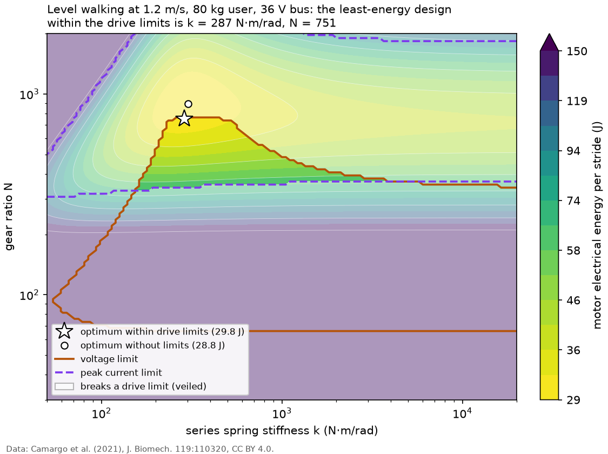

# Powered Ankle Prosthesis: Series Elastic Actuator Sizing and Torque Control

A design study in Python. It sizes the spring stiffness and gear ratio of a series elastic actuator (SEA) for a powered ankle prosthesis from human ankle torque and angle data, so that the motor uses as little electrical energy as possible, and then designs and tests the actuator's torque controller. The task follows the public descriptions of homework 1 and homework 3 of **[ME EN 7960 Wearable Robotics](https://www.mech.utah.edu/grads/course-offerings/)** at the [University of Utah](https://www.utah.edu/) ([Prof. Tommaso Lenzi](https://www.mech.utah.edu/directory/faculty/tommaso-lenzi/)), with the motor selection and series and parallel elasticity material of **[AME 60553 Wearable Robotics](https://werolab.nd.edu/teaching/wr/)** at the [University of Notre Dame](https://www.nd.edu/) ([Prof. Edgar Bolivar-Nieto](https://ame.nd.edu/faculty/edgar-bolivar-nieto/)). It is an independent project, not a course submission. The data are the public lower-limb dataset of Camargo et al. (2021), so the design is sized for level walking, ramps and stairs, not only for one walking speed.



*Motor electrical energy per stride for level walking at 1.2 m/s, 80 kg user, maxon EC-4pole 30 on a 36 V bus, over spring stiffness and gear ratio. Veiled designs break the driver's voltage, peak current or speed limit; the star is the least-energy design within the limits. Data: Camargo et al. (2021), CC BY 4.0.*

**Report:** [`report/report.pdf`](report/report.pdf) (8 pages; source [`report/report.md`](report/report.md)).

## Results in brief

All numbers are for 22 subjects, scaled to an 80 kg user, with one real motor, gearhead and driver (maxon EC-4pole 30, GP 32 HP, ESCON 70/10; values and sources in [`data/motors/`](data/motors/)).

- **Level walking.** The least-energy SEA within the drive limits has a spring of **235 N·m/rad and a gear ratio of 725**, at 23.4 J per stride. The best rigid actuator within the same limits needs 52.5 J: without a spring, back EMF at push-off caps the ratio. The energy is a convex quadratic in spring compliance, and the closed-form optimum matches a grid search over the full model ([`results/sizing_levelwalk.md`](results/sizing_levelwalk.md), [`results/convex_check.md`](results/convex_check.md), derivation in [`docs/derivation.md`](docs/derivation.md)).
- **Heat.** No series spring brings the motor under its continuous current rating in walking (5.73 A RMS against 5.06 A), because the copper loss is set by the joint torque. A parallel spring does (4.34 A), but on stairs it raises the current to 13 to 16 A ([`results/parallel_spring.md`](results/parallel_spring.md)).
- **All activities.** Over 47 conditions the optimal stiffness hardly moves (80 % between 182 and 258 N·m/rad) while the optimal ratio falls from 1027 to 482 as walking speeds up. The walking-tuned design breaks the voltage limit in ramp and stair descent. A compromise (**205 N·m/rad, ratio 603**) works everywhere and costs 5 % more in walking; ramp descent sets it, not the daily activity mix ([`results/sizing_modes.md`](results/sizing_modes.md), [`results/cross_mode.md`](results/cross_mode.md)).
- **Torque control.** PID by pole placement with model-based feedforward: 21 Hz bandwidth, 52 deg phase margin in stance, but 44.8 deg in swing (target 45). A disturbance observer after Paine et al. (2014) tracks no better than the PID here. Neither is passive at the joint in the sense of Vallery et al. (2007) once the 1.5 ms loop delay is included ([`results/torque_pid.md`](results/torque_pid.md), [`results/torque_dob.md`](results/torque_dob.md)).
- **Nonlinear simulation** with voltage and current limits: the compromise design tracks level walking to 0.6 % RMS and every condition with at least five subjects to within 3.3 %. The walking-tuned design misses the 5 % target at 1.85 m/s ([`results/tracking.md`](results/tracking.md)).
- **Robustness.** The spring used as a torque sensor is the weak point (a spring 20 % softer than assumed: 11.2 % error, against 1.1 % with a load cell). The delay margin is 4.3 ms in swing, and PID or DOB with feedforward can go unstable against a light, soft, lightly damped load ([`results/robustness.md`](results/robustness.md)).
- **Phase-scheduled command.** A mean torque profile looked up at gait phase misses the person's own ankle moment by 10 to 31 %, even with perfect phase; about half of that is the difference between people. A simple time-based phase estimate adds 1 point on the treadmill and 1 to 4 points on ramps and stairs. The reference, not the actuator, limits the device ([`results/phase_schedule.md`](results/phase_schedule.md)).

This repository is part of a set that goes from a body-worn sensor to a device controller:
- [imu-opensim-validation](https://github.com/mzlumi/imu-opensim-validation): IMU joint angles validated against marker-based motion capture.
- [imu-locomotion-gait-phase](https://github.com/mzlumi/imu-locomotion-gait-phase): locomotion mode and continuous gait phase from wearable IMUs, on the same Camargo dataset. Its estimator was not ready when the phase-scheduled command here was built, so this repository uses a simple time-based phase estimate in its place; plugging that estimator in is the next step.
- [drop-foot-ankle-exo-sim](https://github.com/mzlumi/drop-foot-ankle-exo-sim): an IMU-triggered ankle exoskeleton in a neuromuscular simulation of drop-foot gait.

## Adapted from

### [University of Utah](https://www.utah.edu/), [ME EN 7960-001 Wearable Robotics](https://www.mech.utah.edu/grads/course-offerings/)

- **Instructor:** [Prof. Tommaso Lenzi](https://www.mech.utah.edu/directory/faculty/tommaso-lenzi/) ([HGN Lab for Bionic Engineering](https://hgnlab.mech.utah.edu/)), with teaching assistants Lukas Gabert, Sergei Sarkisian and Dante Archangeli.
- **Term:** Fall 2022 (the syllabus used here). The university class schedule shows the course again in Fall 2024 with the same instructor, and the Mechanical Engineering course plan lists it for Fall 2026.
- **The course:** a graduate overview of the design, modeling and control of powered exoskeletons and robotic limb prostheses. Lectures and readings cover robot morphology, actuation (DC motors, series and parallel elastic actuators, variable stiffness and variable transmission actuators), biosignals (gait kinematics, EMG, indirect calorimetry) and control at three levels (low-level torque control, mid-level impedance and kinematic control, high-level finite-state and phase-based control), followed by case studies. Students also work on the open-source robotic leg prosthesis developed at the [Bionic Engineering Lab](https://hgnlab.mech.utah.edu/). Homework is in MATLAB and Simulink.
- **What the original task asked:**
  - *HW 1, Conceptual Design of Advanced Actuation Systems:* "Based on considerations on Human Biomechanics students will dimension an advanced actuation system such as the one seen in class. (e.g., Dimension a series elastic actuator to minimize the energy consumption of a powered ankle prosthesis)".
  - *HW 3, Closed-loop Control of Advanced Actuation Systems:* "Based on the dynamic models of advanced actuation system students will develop and simulate a low-level closed-loop control system for a wearable robot". The low-level control lecture assigns Vallery et al. (IROS 2007) on passive and accurate SEA torque control and Paine et al. (IEEE/ASME TMech 2014) on the design and control of high-performance SEAs.
  - The full homework handouts are on the course Canvas site, which needs a University of Utah login. Only the syllabus descriptions above are public.
- **Links:** [Mechanical Engineering course plan](https://www.mech.utah.edu/grads/course-offerings/), [syllabus (PDF)](https://rmcoeh.com/images/pdfs-doc/courses-syllabi/MEEN%207960%20Syllabus.pdf), [Utah Robotics Center course list](https://robotics.coe.utah.edu/academics/courses/), [Fall 2022 class schedule](https://class-schedule.app.utah.edu/main/1228/class_list.html?subject=ME+EN).

### [University of Notre Dame](https://www.nd.edu/), [AME 60553 Wearable Robotics](https://werolab.nd.edu/teaching/wr/)

- **Instructor:** [Prof. Edgar Bolivar-Nieto](https://ame.nd.edu/faculty/edgar-bolivar-nieto/) ([Wearable Robotics Laboratory](https://werolab.nd.edu/)).
- **Term:** first offered in Fall 2023 (the handwritten lecture notes used here are from that term). It is taught again in Fall 2026, with a public course repository.
- **The course:** the biomechanical and mechatronic principles behind wearable robots: analysis of human movement (inverse kinematics and dynamics in OpenSim), selection of brushed and brushless DC motors, the role of series and parallel elasticity, transmissions and winding heat, convex and robust optimization for mechanical design and real-time control, and control of lower-limb prostheses and orthoses (impedance, finite-state machines, phase variables). The course page says its organization and content were inspired by [ROB 646 (BIOMEDE 646, MECHENG 646) Locomotion Mechanics and Design/Control of Wearable Robotic Systems](https://bulletin.engin.umich.edu/courses/robotics-courses/) by [Prof. Elliott Rouse](https://me.engin.umich.edu/people/faculty/elliott-rouse/) ([Neurobionics Lab](https://neurobionics.robotics.umich.edu/)) at the [University of Michigan](https://umich.edu/).
- **What the original material asks:**
  - *Assignment 5 (Fall 2026), motor selection for an elbow prosthesis:* "Pick the lightest brushed DC motor (plus a reduction ratio) that can drive an elbow prosthesis through repeated lifting cycles", with the load torque against velocity, the motor's feasible speed and torque region, the motor voltages and the energy over ten cycles. The full statement is on the course Canvas and Gradescope and is not public.
  - *Lectures 12 and 13 (Fall 2023), the role of series and parallel elasticity:* the motor energy of a series elastic actuator written as a convex quadratic function of the spring compliance, and the effect of a parallel spring on motor torque and energy, with the reading Bolivar-Nieto et al., "Convex optimization for spring design in series elastic actuators: from theory to practice" (IROS 2021).
  - *Lectures 20 and 21 (Fall 2023):* control of lower-limb powered prostheses and orthoses.
- **Links:** [course page](https://werolab.nd.edu/teaching/wr/), [Notre Dame Robotics course list](https://robotics.nd.edu/academics/courses/), [course repository WeRoLab/WR26](https://github.com/WeRoLab/WR26).

The saved documents and their original locations are listed in [`docs/SOURCES.md`](docs/SOURCES.md).

## The problem

**Actuator sizing.** The prosthesis ankle must reproduce the ankle torque τ(t) and angle θ(t) of an able-bodied person. An SEA puts a spring of stiffness k between a geared motor (ratio N) and the joint. For a given (k, N), the spring deflection is τ/k, so the motor angle is θ_m = N(θ + τ/k). The motor torque must supply τ/(Nη) through a gearbox of efficiency η, plus the torque to accelerate the reflected rotor inertia and to overcome friction. The current is that torque divided by the torque constant. Electrical power is the copper loss i²R plus the mechanical power, and the energy per stride is its integral, with and without regeneration. A design is feasible only if the required voltage stays below the bus voltage and the peak and RMS currents stay within the motor's limits.

1. Build the load from the Camargo et al. data: cut ankle torque and angle into strides with the gait events, remove strides with gaps, normalize to the gait cycle, and average per mode and condition (treadmill speed, ramp incline, stair height), scaled to a chosen user mass.
2. Model a real motor and gearbox from a manufacturer's datasheet (cited in [`data/README.md`](data/README.md)).
3. Sweep k and N on a grid, compute energy per stride and the feasibility constraints, and find the optimum. Check the grid against the convex formulation from the Notre Dame material: for a fixed gear ratio, energy is a quadratic function of the spring compliance, so the optimum has a closed form.

**Torque control.** With the chosen design, model the SEA as a plant from motor current to spring torque, with the ankle motion as a disturbance. Design a torque controller (PID with model-based feedforward), then a disturbance-observer variant in the spirit of the assigned readings. Show the open- and closed-loop Bode plots, the bandwidth and stability margins, and the effect of voltage and current saturation. Then simulate the closed loop tracking the gait torque profile of each mode.

## Data

[Camargo et al. (2021)](https://doi.org/10.1016/j.jbiomech.2021.110320): 22 able-bodied adults on a treadmill at 28 speeds, on level ground at three speeds, on ramps (six inclines are described for the dataset; the files hold 5.2, 7.8 and 9.2 degrees) and on stairs at up to four step heights, with OpenSim inverse kinematics and inverse dynamics at 200 Hz. CC BY 4.0. The data are not stored here; [`scripts/fetch_data.py`](scripts/fetch_data.py) downloads the needed folders into the git-ignored `data/raw/`. [`data/README.md`](data/README.md) describes the layout, the license, and what was checked in the files (the `.mat` files hold MATLAB tables that SciPy cannot read, the ankle moment is in N·m and not normalized, and not every subject has every stair height).

## Going beyond the coursework

- **All locomotion modes.** The homework sizes the actuator for level walking. Here the sizing is done for every mode and condition, to show how the optimal stiffness and gear ratio move between walking, ramps and stairs.
- **The cost of tuning for walking.** How much extra energy a design tuned for level walking uses on stairs and ramps, compared with each mode's own optimum, and whether one compromise design (weighted over modes) loses much anywhere.
- **A parallel spring.** Add a parallel spring option and compare energy and peak current with the pure SEA.
- **Phase-scheduled torque command.** Generate the torque reference from gait phase and mode and compare it with the moment each person actually produced, with the dataset's own gait events as an oracle phase and with a causal time-based phase estimate (heel strikes detected 0, 25 or 50 ms late). The estimator from [imu-locomotion-gait-phase](https://github.com/mzlumi/imu-locomotion-gait-phase) was meant to take that place but is not ready yet.
- **Robustness.** Tracking and stability with errors in spring stiffness and motor constants, sensor noise, loop delay, and coupling to passive environments.

## Install and run

Python 3.11 or newer.

```sh
python3 -m venv .venv
source .venv/bin/activate
pip install -e ".[dev]"
pytest                                   # tests that need the raw data are skipped without it
```

The sizing and control scripts read the committed aggregate profiles in [`results/profiles/`](results/profiles/), so they run without the dataset:

```sh
python scripts/size_levelwalk.py         # likewise convex_check, size_modes, cross_mode,
                                         # parallel_spring, plant_bode, torque_pid, torque_dob,
                                         # tracking, robustness
```

The data inventory, the stride segmentation and the phase-schedule study need the raw data (about 3.2 GB for all 22 subjects):

```sh
python scripts/fetch_data.py --subjects all --dry-run   # list files and size
python scripts/fetch_data.py --subjects all
python scripts/run_all.py                # every script in dependency order, rewrites results/
./report/build.sh                        # report/report.pdf, needs pandoc and xelatex
```

Each script writes a Markdown page to `results/` and its figure to `results/figures/`. The assumptions that change a result (user mass, bus voltage, gear efficiency, activity mix and others) are listed with sources in [`docs/assumptions.md`](docs/assumptions.md).

**Layout.** `src/anklesea/` holds the library: data loading and strides (`camargo.py`, `inventory.py`, `strides.py`, `profiles.py`), motor, energy model and sizing (`motor.py`, `sea.py`, `sizing.py`, `parallel.py`, `designs.py`), plant and control (`plant.py`, `torque_control.py`, `simulation.py`) and phase scheduling (`phase.py`). `scripts/` produces every result, `tests/` checks the library.

## Validation

- The energy model is tested on cases with known answers (rigid actuator as k grows large, zero inertia, sinusoidal loads with a closed-form energy).
- The grid search is checked against the closed-form optimum in spring compliance for fixed gear ratio, and the parallel-spring design against a brute-force grid.
- The stride-averaged ankle angles are compared with the averaged angles on the dataset's web page (the paper's moment figures were not accessible), and the sign convention is checked on the data.
- The nonlinear time-domain simulation reproduces the sizing model's energy and currents within 1 % with the limits removed, and the linear controller analysis is checked against it.
- Results that fail or do not hold up are reported, not hidden: see "What did not work" in the report.

## Status

- [x] Course documents and sources ([`docs/SOURCES.md`](docs/SOURCES.md))
- [x] Dataset description and download script
- [x] Package scaffolding, tests and CI
- [x] Camargo data loader, data inventory, stride segmentation and averaged gait profiles per mode
- [x] Motor and gearbox model from a real datasheet
- [x] SEA energy model with constraints, with tests
- [x] Sizing sweep for level walking, checked against the convex closed form
- [x] Sizing across all modes, cost of a walking-tuned design, design table
- [x] Parallel spring option
- [x] SEA plant model, torque controller, Bode plots, disturbance observer
- [x] Time-domain tracking with saturation, robustness study
- [x] Phase-scheduled torque command (with a time-based phase estimate in place of the companion repository's estimator)
- [x] Report and final README

## What I learned

- **Write the optimization so its structure shows.** Written in compliance rather than stiffness, the motor energy is a quadratic and every drive limit is an interval, so the constrained optimum is a clipped closed form. That turned a slow grid search into a check, and made it obvious why the spring saves energy only through the rotor inertia.
- **The hardest activity sizes the transmission.** I expected the daily mix of walking, ramps and stairs to set the compromise design. It hardly matters: as long as every activity must stay within the voltage limit, ramp descent fixes the ratio.
- **Design to a limit and the controller has nothing left.** Energy-optimal designs sit exactly on the voltage limit, and the tracking errors at fast walking come from there, not from the controller. A real design needs a voltage margin.
- **Bandwidth is not the right tuning target.** My first PID met the 6 Hz bandwidth target and still left 6 % error, because gait torque lives at the first few stride harmonics. And a disturbance observer that works on the command instead of the torque the motor actually produced winds up under saturation (57.6 % error before the fix, 8.8 % after).
- **Check what limits the system end to end.** The torque loop tracks to well under 1 %, but a phase-scheduled reference misses the person's own moment by 10 % or more. Improving the reference matters more than improving the controller.

## Citation

Camargo, J., Ramanathan, A., Flanagan, W., Young, A. (2021). A comprehensive, open-source dataset of lower limb biomechanics in multiple conditions of stairs, ramps, and level-ground ambulation and transitions. *Journal of Biomechanics* 119, 110320. [doi:10.1016/j.jbiomech.2021.110320](https://doi.org/10.1016/j.jbiomech.2021.110320). Data under CC BY 4.0. The methods follow Bolivar-Nieto et al. (IROS 2021), Paine et al. (IEEE/ASME TMech 2014) and Vallery et al. (IROS 2007); the full reference list is in the report.

## Credit

The homework descriptions, lecture notes, course pages and assignment text belong to the [University of Utah](https://www.utah.edu/) ([Prof. Tommaso Lenzi](https://www.mech.utah.edu/directory/faculty/tommaso-lenzi/) and the [ME EN 7960](https://www.mech.utah.edu/grads/course-offerings/) teaching staff) and the [University of Notre Dame](https://www.nd.edu/) ([Prof. Edgar Bolivar-Nieto](https://ame.nd.edu/faculty/edgar-bolivar-nieto/) and the [AME 60553](https://werolab.nd.edu/teaching/wr/) teaching staff). The dataset is by Camargo, Ramanathan, Flanagan and Young (Georgia Tech EPIC Lab), used under CC BY 4.0. The code is written for this project by Parmida Mazloomi with the help of AI coding tools, from the public course descriptions and the cited papers; no code from past students' solutions and no course starter code is used.
