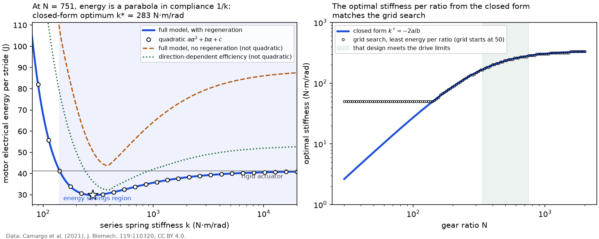

# Convex check of the sizing

For a fixed gear ratio, the energy per stride with ideal regeneration and a constant gear efficiency is a convex quadratic in the spring compliance `alpha = 1/k` (derivation in [`docs/derivation.md`](../docs/derivation.md); method of Bolivar-Nieto et al., IROS 2021). This page checks the grid search of `results/sizing_levelwalk.md` against that closed form, for the same load (level walking at 1.2 m/s, 80 kg user).

*Left: energy against stiffness at the chosen ratio. The full model (line) and the quadratic (circles) coincide; the star is the closed-form optimum; the shaded band is the energy savings region, every spring that beats the rigid actuator. Right: closed-form optimal stiffness per ratio against the grid search. Data: Camargo et al. (2021), CC BY 4.0.*

| check | result |
|---|---|
| largest relative difference between the quadratic and the full model over all 14762 grid designs | 1.5e-15 |
| quadratic coefficient `a` positive (convex) at every ratio | yes |
| closed-form optimum at N = 751 | k* = 282.8 N·m/rad, 29.82 J |
| dense search with the full model (30001 compliances) at N = 751 | k = 282.8 N·m/rad, 29.82 J |
| grid optimum (121 stiffness values) | k = 287 N·m/rad, 29.82 J |
| largest excess of the grid's best energy per ratio over the closed-form optimum, for ratios whose k* lies inside the grid | 0.06% |
| ratios whose k* lies outside the grid's stiffness range | 45 (the lowest ratios; k* down to 3 N·m/rad) |
| optimum within the drive limits from the closed form clipped to the feasible compliance interval, 2000 ratios | k = 302.3 N·m/rad, N = 774, 29.56 J |
| any ratio with a compliance that also meets the RMS current rating | no |
| energy savings region at N = 751 | k > 141 N·m/rad |
| rigid actuator at N = 751 (`c`) | 41.21 J |

The quadratic matches the full model to rounding error. The inductive term `L i di/dt` drops out of the closed form because it integrates to zero over a periodic stride, and the periodic central difference used for `di/dt` in the full model keeps that exact. The grid search is therefore only limited by its resolution: its optimum lies within one grid step of the closed form.

The limits fit the same structure. At a fixed ratio the current, motor speed and voltage are affine in `alpha` at every instant, so each instantaneous limit allows an interval of compliances and all of them together allow one interval; the RMS current limit is a convex quadratic inequality and allows an interval too. The constrained optimum at that ratio is the unconstrained `alpha*` clipped into the interval (`anklesea.sizing.constrained_optimum`). A one-dimensional scan over the ratio then finds the constrained optimum without any stiffness grid. It lands 0.9% below the grid optimum, at a ratio between two grid rows: the optimum sits on the voltage limit, and the grid's ratio step (3.6 %) cannot follow that boundary exactly. It also confirms that no ratio has a compliance meeting the motor's continuous current rating.

Two variants are *not* quadratic and are shown dashed in the left panel. Without regeneration, the energy integrates `max(P, 0)`, which is not a quadratic in `alpha` and has no closed form; its optimum at this ratio is k = 381 N·m/rad, stiffer than with regeneration because a softer spring lets the motor return energy that would now be lost. With a direction-dependent gear efficiency, the optimum is k = 386 N·m/rad. Both are reported by the grid search, which does not rely on the quadratic form.

Practical value of the closed form: the optimal stiffness for any ratio costs three integrals instead of a sweep over `k`, and the savings region tells the designer how far the spring may deviate from the optimum (for tolerance or for a second activity) and still beat a rigid actuator.
