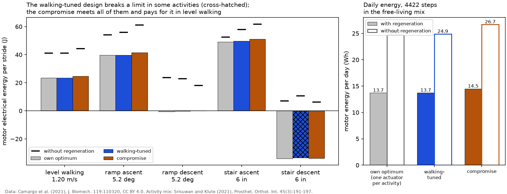

# One actuator for several activities

A prosthesis has one spring and one transmission. This page asks two questions. What does a design tuned for level walking cost in the other activities? And which single design minimizes the energy over a typical day?

**Daily mix.** Shares of steps from a free-living study of ten people with a transtibial prosthesis, monitored with an instrumented pylon over 1 to 2 weekdays (Srisuwan and Klute, *Prosthet. Orthot. Int.* 45(3):191-197, 2021, Table 3). Turning steps (9.0 %) are counted as level walking, which they resemble most of the conditions here. The same study gives 4422 steps per day, so 2211 strides of the prosthetic leg. Recorded in `docs/assumptions.md`.

**Conditions.** One dataset condition stands for each activity: level walking is the treadmill at 1.2 m/s, as in `results/sizing_levelwalk.md`; ramps and stairs use the incline and step height closest to the course in the mix source (5 degree ramps, 18 cm steps), among conditions with enough subjects.

| activity | condition | subjects (strides) | share of steps |
|---|---|---|---|
| level walking | 1.20 m/s | 22 (676) | 91.8% |
| ramp ascent | 5.2 deg | 7 (14) | 1.6% |
| ramp descent | 5.2 deg | 19 (68) | 2.0% |
| stair ascent | 6 in | 22 (86) | 2.3% |
| stair descent | 6 in | 22 (109) | 2.5% |

**Designs compared.** *Own optimum*: the best design for that activity alone (a lower bound no single actuator reaches). *Walking-tuned*: the level-walking optimum, k = 235 N·m/rad, N = 739. *Compromise*: the design with the least step-weighted energy that meets the drive limits in all five activities, k = 205 N·m/rad, N = 603. The weighted energy is again a convex quadratic in compliance at each ratio, so the compromise comes from the same clipped closed form (`anklesea.sizing.optimize_mix`). All at 80 kg and 36 V.

*Left: energy per stride in each activity for the three designs (bars with ideal regeneration, black ticks without; cross-hatched bars break a drive limit). Right: energy per day over the free-living mix. Data: Camargo et al. (2021), CC BY 4.0; activity mix: Srisuwan and Klute (2021).*

## Energy per stride

Energy with ideal regeneration; in brackets, the extra over the activity's own optimum.

| activity (condition) | share of steps | own optimum | own energy (J) | walking-tuned design (J) | compromise design (J) | no regeneration: own / walking / compromise (J) |
|---|---|---|---|---|---|---|
| level walking (1.20 m/s) | 91.8% | k = 235 N·m/rad, N = 739 | 23.4 | 23.4 (+0.0) | 24.7 (+1.3) | 41.0 / 41.0 / 44.3 |
| ramp ascent (5.2 deg) | 1.6% | k = 248 N·m/rad, N = 739 | 39.6 | 39.7 (+0.1) | 41.5 (+1.9) | 54.0 / 56.0 / 61.2 |
| ramp descent (5.2 deg) | 2.0% | k = 155 N·m/rad, N = 633 | -0.6 | -0.2 (+0.4), **breaks limits** (43 V, 11 A) | 0.0 (+0.6) | 23.7 / 22.8 / 18.0 |
| stair ascent (6 in) | 2.3% | k = 339 N·m/rad, N = 749 | 49.0 | 49.8 (+0.7) | 51.2 (+2.2) | 52.5 / 57.9 / 61.7 |
| stair descent (6 in) | 2.5% | k = 190 N·m/rad, N = 633 | -33.9 | -33.5 (+0.4), **breaks limits** (40 V, 9 A) | -33.7 (+0.2) | 6.9 / 10.6 / 6.3 |

## Energy per day

| design | with regeneration (Wh/day) | without regeneration (Wh/day) |
|---|---|---|
| own optimum in each activity (lower bound) | 13.71 | 24.74 |
| walking-tuned | 13.73 | 24.88 |
| compromise | 14.49 | 26.69 |

- The walking-tuned design **breaks the drive limits** in ramp descent and stair descent: it could not produce the torque those activities need at the speed they need it, whatever the energy.
- The compromise is decided by the limits rather than by the weights. At k = 205 N·m/rad, N = 603 the limit binds in ramp descent; to stay feasible there, the ratio drops from 739 to 603, and level walking, 92% of the steps, pays +1.3 J per stride (+5%).
- Over a day the compromise uses 14.5 Wh at the motor terminals (with regeneration; 26.7 Wh without), against 13.7 Wh for the unreachable lower bound. The walking-tuned design would use 13.7 Wh but cannot do every activity.
- Feasibility and heat constrain this actuator more than energy does: the voltage limit picks the ratio, and the RMS current, not the energy, is what this motor cannot sustain in walking (`results/sizing_levelwalk.md`).

## Sensitivity to the weights and conditions

Each row recomputes the compromise with one assumption changed, then evaluates that design on the baseline conditions and mix, so the daily energies compare like with like.

| case | compromise design | daily energy on the baseline mix (Wh) | same, no regeneration (Wh) |
|---|---|---|---|
| baseline: Srisuwan and Klute (2021) mix, energy with regeneration | k = 205 N·m/rad, N = 603 | 14.49 | 26.69 |
| ramps and stairs three times as frequent | k = 205 N·m/rad, N = 603 | 14.49 | 26.69 |
| equal weight on all five activities | k = 205 N·m/rad, N = 603 | 14.49 | 26.69 |
| level walking only (but within limits everywhere) | k = 205 N·m/rad, N = 603 | 14.49 | 26.69 |
| objective: energy without regeneration (grid search) | k = 317 N·m/rad, N = 567 | 15.45 | 20.92 |
| level walking at 1.0 m/s | k = 196 N·m/rad, N = 607 | 14.51 | 27.90 |
| level walking at 1.4 m/s | k = 216 N·m/rad, N = 599 | 14.51 | 25.54 |
| lowest ramp and stair conditions | k = 205 N·m/rad, N = 603 | 14.49 | 26.69 |
| highest ramp and stair conditions | k = 174 N·m/rad, N = 410 | 19.23 | 33.71 |
| bus voltage 48 V (limits checked at 48 V) | k = 238 N·m/rad, N = 771 | 13.71 | 25.13 |

4 of the 9 changed cases land on exactly the baseline compromise: as long as every activity must stay within the limits, the weights hardly matter, because the feasible region is narrow and the binding activity fixes the ratio. What does move the design is a change in *which* conditions must be feasible (a faster walking speed or steeper ramps and stairs), the energy measure (without regeneration the optimum prefers a stiffer spring), and the bus voltage: at 48 V the voltage limit relaxes and the compromise can return toward the walking-tuned design. The practical lesson is that the hardest activity sizes the transmission; the daily mix at most fine-tunes the spring.
