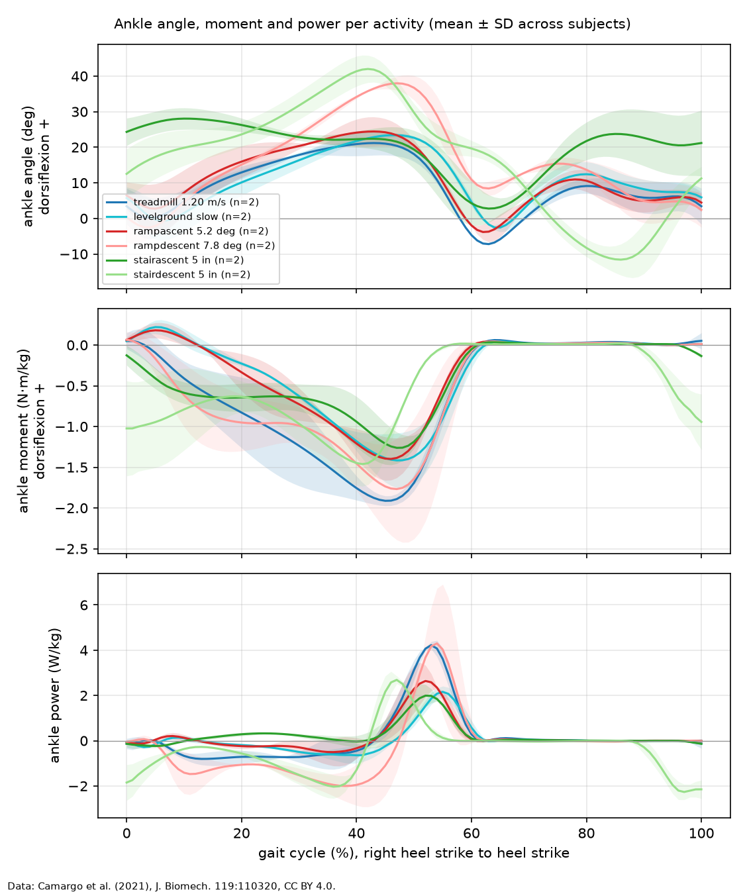
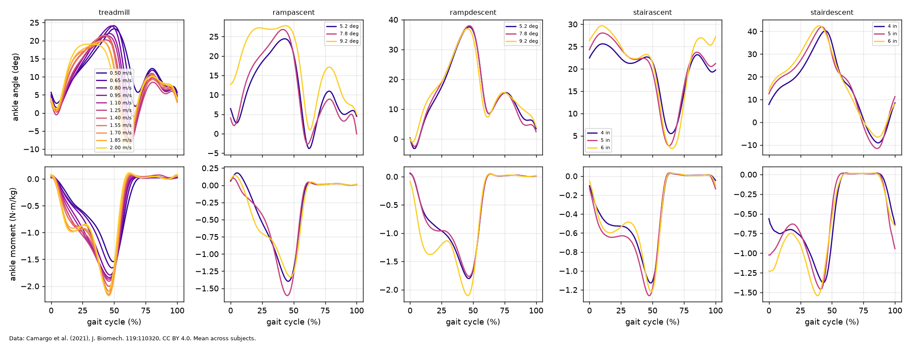

# Averaged ankle gait profiles

Generated by `scripts/gait_profiles.py` from 2 subjects (AB06, AB07). Right-leg strides from heel strike to heel strike, kept only when the stance is on a force plate (the moment is NaN elsewhere), the stance has one steady locomotion label, and the duration is within 25 % of the subject's median for that condition. Each subject's strides are averaged first, then the subject means are averaged. Moments and powers are divided by body mass. Mean and SD curves: [`profiles/gait_profiles.csv`](profiles/gait_profiles.csv). Data: Camargo, Ramanathan, Flanagan, Young (2021), J. Biomech. 119:110320, doi:10.1016/j.jbiomech.2021.110320, CC BY 4.0.

Sign convention: angle and moment positive in dorsiflexion (OpenSim), power = moment x angular velocity, positive when the ankle does work. `at_pct` columns give where each extremum falls in the gait cycle.

| activity | condition | subjects | strides | stride_time_s | max_dorsiflexion_deg | at_pct | max_plantarflexion_deg | at_pct | peak_PF_moment_Nm_per_kg | at_pct | peak_power_W_per_kg | at_pct | net_work_J_per_kg |
|---|---|---|---|---|---|---|---|---|---|---|---|---|---|
| treadmill | 0.50 m/s | 2 | 40 | 1.572 | 23.3 | 50 | -2.7 | 4 | 1.54 | 49 | 0.95 | 58 | -0.077 |
| treadmill | 0.55 m/s | 2 | 41 | 1.523 | 23.5 | 50 | -2.2 | 4 | 1.58 | 49 | 1.27 | 58 | -0.062 |
| treadmill | 0.60 m/s | 2 | 43 | 1.486 | 23.9 | 49 | -2.1 | 4 | 1.68 | 48 | 1.5 | 57 | -0.051 |
| treadmill | 0.65 m/s | 2 | 68 | 1.388 | 24.1 | 50 | -1.4 | 4 | 1.66 | 48 | 1.78 | 57 | -0.066 |
| treadmill | 0.70 m/s | 2 | 46 | 1.368 | 23.7 | 49 | 0.5 | 66 | 1.72 | 48 | 2.07 | 56 | -0.027 |
| treadmill | 0.75 m/s | 2 | 48 | 1.341 | 23.3 | 48 | 1.2 | 65 | 1.75 | 47 | 2.28 | 55 | -0.016 |
| treadmill | 0.80 m/s | 2 | 48 | 1.287 | 24.1 | 48 | 1.1 | 65 | 1.79 | 47 | 2.58 | 55 | -0.015 |
| treadmill | 0.85 m/s | 2 | 48 | 1.293 | 23.2 | 48 | 2.5 | 65 | 1.78 | 47 | 2.75 | 55 | 0.01 |
| treadmill | 0.90 m/s | 2 | 49 | 1.262 | 22.4 | 46 | 3.4 | 64 | 1.84 | 47 | 3.09 | 55 | 0.065 |
| treadmill | 0.95 m/s | 2 | 51 | 1.21 | 22.0 | 46 | 4.4 | 64 | 1.84 | 46 | 3.14 | 55 | 0.061 |
| treadmill | 1.00 m/s | 2 | 53 | 1.188 | 21.8 | 46 | 5.4 | 64 | 1.84 | 47 | 3.33 | 55 | 0.08 |
| treadmill | 1.05 m/s | 2 | 80 | 1.163 | 22.7 | 46 | 5.6 | 64 | 1.87 | 47 | 3.59 | 54 | 0.084 |
| treadmill | 1.10 m/s | 2 | 55 | 1.131 | 21.3 | 45 | 6.7 | 64 | 1.87 | 46 | 3.8 | 54 | 0.116 |
| treadmill | 1.15 m/s | 2 | 56 | 1.118 | 21.5 | 44 | 7.2 | 63 | 1.89 | 46 | 4.0 | 53 | 0.143 |
| treadmill | 1.20 m/s | 2 | 58 | 1.087 | 21.2 | 43 | 7.2 | 63 | 1.91 | 45 | 4.22 | 53 | 0.159 |
| treadmill | 1.25 m/s | 2 | 59 | 1.075 | 20.2 | 43 | 8.4 | 63 | 1.91 | 46 | 4.44 | 53 | 0.194 |
| treadmill | 1.30 m/s | 2 | 59 | 1.052 | 22.1 | 43 | 5.6 | 63 | 2.0 | 46 | 4.7 | 53 | 0.195 |
| treadmill | 1.35 m/s | 2 | 61 | 1.034 | 22.1 | 43 | 7.5 | 62 | 2.02 | 46 | 5.26 | 53 | 0.244 |
| treadmill | 1.40 m/s | 2 | 61 | 1.015 | 21.5 | 43 | 7.1 | 62 | 2.0 | 46 | 5.16 | 52 | 0.225 |
| treadmill | 1.45 m/s | 2 | 94 | 0.996 | 22.0 | 43 | 7.3 | 62 | 2.05 | 46 | 5.57 | 52 | 0.233 |
| treadmill | 1.50 m/s | 2 | 63 | 0.986 | 21.8 | 43 | 8.0 | 62 | 2.08 | 46 | 5.8 | 52 | 0.257 |
| treadmill | 1.55 m/s | 2 | 64 | 0.978 | 21.4 | 42 | 8.1 | 61 | 2.1 | 46 | 6.0 | 52 | 0.29 |
| treadmill | 1.60 m/s | 2 | 65 | 0.965 | 21.4 | 42 | 8.2 | 61 | 2.12 | 46 | 6.24 | 52 | 0.307 |
| treadmill | 1.65 m/s | 2 | 64 | 0.965 | 21.4 | 43 | 8.6 | 61 | 2.17 | 46 | 6.58 | 52 | 0.328 |
| treadmill | 1.70 m/s | 2 | 70 | 0.929 | 19.8 | 41 | 7.5 | 60 | 2.15 | 45 | 6.23 | 51 | 0.339 |
| treadmill | 1.75 m/s | 2 | 72 | 0.913 | 19.7 | 40 | 8.2 | 60 | 2.16 | 46 | 6.55 | 51 | 0.365 |
| treadmill | 1.80 m/s | 2 | 73 | 0.901 | 19.1 | 40 | 8.7 | 60 | 2.17 | 46 | 6.76 | 51 | 0.39 |
| treadmill | 1.85 m/s | 2 | 108 | 0.9 | 20.0 | 40 | 8.3 | 60 | 2.18 | 46 | 6.86 | 51 | 0.388 |
| treadmill | 1.90 m/s | 2 | 74 | 0.882 | 19.6 | 39 | 8.1 | 60 | 2.15 | 46 | 6.78 | 50 | 0.386 |
| treadmill | 1.95 m/s | 2 | 73 | 0.893 | 19.3 | 36 | 8.9 | 60 | 2.13 | 46 | 6.89 | 50 | 0.413 |
| treadmill | 2.00 m/s | 2 | 74 | 0.877 | 19.0 | 30 | 9.8 | 59 | 2.11 | 45 | 6.89 | 49 | 0.439 |
| treadmill | 2.05 m/s | 2 | 75 | 0.871 | 18.1 | 27 | 10.6 | 59 | 2.14 | 45 | 7.13 | 49 | 0.46 |
| levelground | slow | 2 | 3 | 1.375 | 23.4 | 47 | 2.6 | 65 | 1.42 | 47 | 2.16 | 55 | 0.064 |
| levelground | normal | 1 | 8 | 1.311 | 24.8 | 46 | 5.1 | 65 | 1.79 | 48 | 3.36 | 55 | 0.107 |
| levelground | fast | 1 | 4 | 1.072 | 25.3 | 43 | 7.8 | 62 | 2.05 | 46 | 5.94 | 52 | 0.253 |
| rampascent | 5.2 deg | 2 | 6 | 1.262 | 24.4 | 43 | 3.8 | 62 | 1.4 | 46 | 2.64 | 52 | 0.204 |
| rampascent | 7.8 deg | 1 | 2 | 1.248 | 26.8 | 41 | 2.7 | 61 | 1.61 | 45 | 3.52 | 51 | 0.263 |
| rampascent | 9.2 deg | 1 | 2 | 1.21 | 27.8 | 44 | -0.9 | 63 | 1.33 | 47 | 2.48 | 54 | 0.262 |
| rampdescent | 5.2 deg | 2 | 11 | 1.192 | 37.6 | 47 | 3.2 | 3 | 1.8 | 47 | 4.38 | 54 | -0.277 |
| rampdescent | 7.8 deg | 2 | 10 | 1.18 | 38.0 | 47 | 2.5 | 4 | 1.77 | 47 | 4.3 | 54 | -0.296 |
| rampdescent | 9.2 deg | 1 | 5 | 1.128 | 37.0 | 46 | 1.1 | 2 | 2.11 | 46 | 5.34 | 52 | -0.341 |
| stairascent | 4 in | 2 | 11 | 1.414 | 25.6 | 10 | -5.5 | 65 | 1.13 | 49 | 1.46 | 53 | 0.197 |
| stairascent | 5 in | 2 | 14 | 1.244 | 28.0 | 10 | -2.8 | 63 | 1.26 | 47 | 1.99 | 52 | 0.277 |
| stairascent | 6 in | 2 | 6 | 1.378 | 29.7 | 10 | -2.1 | 66 | 1.22 | 49 | 2.04 | 53 | 0.283 |
| stairdescent | 4 in | 2 | 11 | 1.319 | 40.3 | 45 | 9.1 | 87 | 1.38 | 43 | 1.87 | 51 | -0.406 |
| stairdescent | 5 in | 2 | 12 | 1.111 | 42.0 | 42 | 11.6 | 86 | 1.46 | 41 | 2.69 | 47 | -0.461 |
| stairdescent | 6 in | 2 | 9 | 1.211 | 42.5 | 40 | 6.6 | 86 | 1.54 | 39 | 1.49 | 48 | -0.474 |

## Sign check on the averaged profiles

- treadmill: peak plantarflexion moment between 45 and 49 % of the cycle (late stance) in all 32 conditions, with net positive ankle work in 25 of 32.
- levelground: peak plantarflexion moment between 46 and 48 % of the cycle (late stance) in all 3 conditions, with net positive ankle work in 3 of 3.
- rampascent: peak plantarflexion moment between 45 and 47 % of the cycle (late stance) in all 3 conditions, with net positive ankle work in 3 of 3.
- stairascent: peak plantarflexion moment between 47 and 49 % of the cycle (late stance) in all 3 conditions, with net positive ankle work in 3 of 3.
- rampdescent: net negative ankle work (the ankle absorbs energy) in 3 of 3 conditions.
- stairdescent: net negative ankle work (the ankle absorbs energy) in 3 of 3 conditions.

## Comparison with the dataset paper

The full text of Camargo et al. (2021) is behind the publisher's paywall and was not available, so its moment and power figures could not be compared. The EPIC Lab dataset page shows the averaged hip, knee and ankle *angles* per mode for all subjects, and those were read by eye (to a few degrees). The table compares them with the profiles here.

| activity | condition | source | peak dorsiflexion (deg, at %) | peak plantarflexion (deg, at %) |
|---|---|---|---|---|
| treadmill | 1.20 m/s | dataset page figure | 10 (48) | 15 (64) |
| treadmill | 1.20 m/s | this project (`ik`) | 21.2 (43) | 7.2 (63) |
| stairascent | 5 in | dataset page figure | 12 (3) | 12 (63) |
| stairascent | 5 in | this project (`ik`) | 28.0 (10) | -2.8 (63) |
| stairdescent | 5 in | dataset page figure | 25 (42) | 25 (90) |
| stairdescent | 5 in | this project (`ik`) | 42.0 (42) | 11.6 (86) |

The shapes and timings agree, but the angles here sit about 10 to 17 degrees further into dorsiflexion. The difference is a constant offset: the `ik` folder holds absolute OpenSim joint angles, while the dataset's `ik_offset` folder (added in the 2024 update) holds the same angles relative to each subject's static standing pose. For AB06 the right-ankle difference between the two is exactly 13.6 degrees at every sample of the treadmill trials, and subtracting it brings the peaks here to within about 5 degrees of the figures, which are consistent with offset-corrected angles. The actuator model uses only angle *changes* (motor speed and acceleration depend on the angular velocity and acceleration), and the rest angle of the parallel spring is a design variable, so the offset does not affect any result. The `ik` angles are kept so that only the folders listed in `data/README.md` are needed.

Moments and powers could only be checked for plausibility: at 1.2 m/s on the treadmill the peak plantarflexion moment and peak ankle power per kg are of the size commonly reported for able-bodied walking near that speed, both grow with speed, and the positive power burst follows the moment peak as expected for push-off.

Level-ground and stair profiles rest on few strides per subject, because only one or two right-leg stances per pass land on a force plate; the treadmill's instrumented belt gives a moment for every stride.
