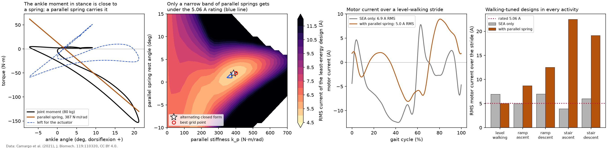

# Parallel spring

`results/sizing_levelwalk.md` found that no series spring brings the RMS current of level walking under the motor's continuous rating (5.06 A): the copper loss of the torque itself does not depend on the series spring. A spring *in parallel* with the actuator carries part of the joint torque, so the motor delivers less. This page sizes one for level walking at 1.2 m/s (80 kg, 36 V), together with the series spring and ratio.

**Model.** Parallel spring torque `tau_p = -k_p (theta - theta_0)`, linear and acting in both directions; the actuator supplies `tau - tau_p`. For a fixed series compliance and ratio, the mean squared motor current and the energy are convex quadratics in `(k_p, k_p theta_0)` (`docs/derivation.md`, section 9). At each ratio the design alternates the closed-form parallel spring with the closed-form series compliance clipped to the limits, which converges in a few steps (`anklesea.parallel.optimize_parallel`). A test checks that a zero parallel spring reproduces the SEA exactly.

*Left: joint moment against angle over the stride, the parallel spring's line and what remains for the actuator. Middle: motor current. Right: RMS current of the walking-tuned designs in each activity against the motor's rating. Data: Camargo et al. (2021), CC BY 4.0.*

## Level walking

| design | series k (N·m/rad) | N | parallel spring | energy (J) | no regen. (J) | RMS current (A) | peak current (A) | peak voltage (V) |
|---|---|---|---|---|---|---|---|---|
| SEA only, drive limits | 294 | 771 | none | 29.6 | 49.2 | 6.93 | 12.5 | 34.2 |
| SEA plus parallel spring, all limits | inf | 346 | 387 N·m/rad, rest 1.9 deg | 22.9 | 33.6 | 5.01 | 8.9 | 33.8 |

- The SEA alone (drive limits) needs 6.93 A RMS. With the parallel spring sized for the least RMS current, the design meets **every** limit, including the continuous current rating, at 5.01 A (28% lower).
- The parallel spring is 387 N·m/rad with its rest angle at 1.9 deg of the `ik` ankle angle. The joint-level least-squares fit, which ignores the motor, gives 349 N·m/rad at 1.2 deg: the motor dynamics shift the optimum only a little.
- The series spring disappears: the best series stiffness is rigid. The parallel spring already carries the part of the moment that rises against the joint motion in stance, which is exactly what a series spring would otherwise cancel, and what remains for the actuator gains nothing from series compliance. The ratio drops from 771 to 346: without series compliance the motor turns at N times the joint speed, and at the peak joint speed (4.55 rad/s) the back EMF alone is 32.4 V of the 34.2 V available. Energy per stride falls from 29.6 to 22.9 J (49.2 to 33.6 J without regeneration).
- Sizing the parallel spring for least energy rather than least RMS current, or imposing only the drive limits, gives the same design. With a rigid series path the motor speed does not depend on the parallel spring, so the energy's extra term integrates to zero over the stride and both objectives have the same minimizer.
- The brute-force check over 29 stiffnesses and 26 rest angles, each with its own least-energy series spring and ratio, finds its best point at 400 N·m/rad and 2.0 deg with 23.0 J, against 22.9 J for the alternating closed form. The second panel maps the RMS current of the least-energy design within the drive limits for every parallel spring on that grid: only a narrow band of stiffness and rest angle, close to the stance moment-angle slope, gets under the rating, and the margin is small (5.01 A against 5.06 A).

## The same designs in the other activities

A parallel spring tuned to the level-walking moment-angle relation acts the same way on ramps and stairs, where that relation differs (same conditions as `results/cross_mode.md`).

| activity | SEA only (walking-tuned) | SEA plus parallel spring (walking-tuned) |
|---|---|---|
| ramp ascent (5.2 deg) | 30.4 J, 5.01 A RMS | 42.8 J, 8.69 A RMS, breaks RMS |
| ramp descent (5.2 deg) | -18.9 J, 7.01 A RMS, breaks voltage and RMS | 6.9 J, 12.53 A RMS, breaks RMS |
| stair ascent (6 in) | 39.9 J, 3.90 A RMS, breaks voltage | 179.0 J, 22.49 A RMS, breaks peak current and RMS |
| stair descent (6 in) | -42.1 J, 6.01 A RMS, breaks RMS | 40.0 J, 19.15 A RMS, breaks voltage and peak current and RMS |

## Limits of this design

- The spring is linear and acts in swing too, when the joint moment is near zero; the motor then holds the spring's torque, which is visible in the middle panel after toe-off. A spring that engages only in stance (a clutch or a unidirectional spring, as in several powered ankles) would avoid that; it is not modeled because it makes the problem non-smooth.
- The rest angle is relative to the `ik` angle convention; it would be set during fitting.
- A parallel spring tuned for one activity loads the actuator in others, as the table above shows.
