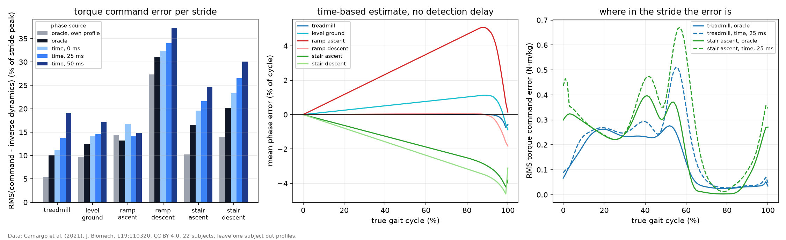

# Phase-scheduled torque command

The torque reference of a phase-scheduled ankle controller is `m * profile(phase)`: the mean ankle moment per kg of the current activity and condition, looked up at the estimated gait phase and scaled by the user's mass `m`. This step asks how close that command comes to the moment the subject actually produced (inverse dynamics in the Camargo et al. (2021) dataset), stride by stride at 200 Hz, and how much of the gap comes from the phase estimate. Script: `scripts/phase_schedule.py`; code: `src/anklesea/phase.py`.

## Setup

- **Strides**: the 19894 kept right-leg strides of 22 subjects (AB06, AB07, AB08, AB09, AB10, AB11, AB12, AB13, AB14, AB15, AB16, AB17, AB18, AB19, AB20, AB21, AB23, AB24, AB25, AB27, AB28, AB30) from `scripts/gait_profiles.py`.
- **Profile**: the mean moment per kg of the same activity and condition over the *other* subjects, so the command is a generic one, not tuned to the person it is tested on. One row also uses the subject's own mean profile, which is the best a fixed profile tuned to that user can do. With 22 subjects the generic profile of each subject is a mean over 21 subjects.
- **Activity and condition** are given to the controller. Recognizing them from sensors is a separate problem, left to a planned IMU-based project.
- **Oracle phase**: linear in time between the dataset's heel strikes (`gcRight`). It knows when the current stride will end, which no device does.
- **Time-based estimate**: the time since the last detected heel strike over the duration of the previous stride, held at 99.9 % if the stride runs long and reset at the next detection; the mean stride time of the profile is used when there is no plausible previous stride (start of a trial or after a pause). The heel strike is detected 0, 25, 50 ms after the dataset's event. Detection latency is an assumption (no detector is modeled; `docs/assumptions.md`). **This estimator stands in for an IMU-based gait phase estimator, planned as a separate project.** It is the simplest causal estimator, not a recommendation.
- **Error**: RMS of command minus inverse-dynamics moment over the stride, in percent of that stride's peak moment, averaged per subject and then across subjects.

## Torque command error (RMS, % of stride peak)

| | treadmill | level ground | ramp ascent | ramp descent | stair ascent | stair descent |
|---|---|---|---|---|---|---|
| oracle, own profile | 5.5 | 9.7 | 14.4 | 27.3 | 10.2 | 14.0 |
| oracle | 10.1 | 12.5 | 13.2 | 31.1 | 16.5 | 20.1 |
| time, 0 ms | 11.2 | 14.1 | 16.7 | 32.4 | 19.6 | 23.3 |
| time, 25 ms | 13.7 | 14.6 | 14.1 | 34.1 | 21.6 | 26.5 |
| time, 50 ms | 19.1 | 17.2 | 14.8 | 37.3 | 24.5 | 30.0 |

Subjects and strides per activity:

| | treadmill | level ground | ramp ascent | ramp descent | stair ascent | stair descent |
|---|---|---|---|---|---|---|
| subjects | 22 | 16 | 8 | 19 | 22 | 22 |
| strides | 18841 | 146 | 30 | 163 | 319 | 395 |

## Phase error of the time-based estimate (RMS, % of the gait cycle)

| | treadmill | level ground | ramp ascent | ramp descent | stair ascent | stair descent |
|---|---|---|---|---|---|---|
| time, 0 ms | 1.3 | 2.0 | 3.1 | 2.1 | 3.2 | 3.3 |
| time, 25 ms | 2.8 | 2.7 | 2.4 | 3.6 | 4.8 | 6.6 |
| time, 50 ms | 5.1 | 4.2 | 3.0 | 5.4 | 6.6 | 9.3 |

## First stride of a segment against later strides (no detection delay)

A stride is the first of a segment when the stride before it is not a kept stride of the same activity and condition: the first steady stride on a staircase or ramp, the first treadmill stride at a new belt speed, or a level-ground stride, since only one stride per pass has a force plate under it.

|  | phase error (% cycle) | torque error, oracle (%) | torque error, time 0 ms (%) | strides |
|---|---|---|---|---|
| treadmill, later strides | 1.2 | 10.1 | 11.1 | 18208 |
| treadmill, first stride of a segment | 2.5 | 10.9 | 13.9 | 633 |
| level ground, first stride of a segment | 2.0 | 12.5 | 14.1 | 146 |
| ramp ascent, first stride of a segment | 3.1 | 13.2 | 16.7 | 30 |
| ramp descent, first stride of a segment | 2.1 | 31.1 | 32.4 | 163 |
| stair ascent, later strides | 6.1 | 15.1 | 22.5 | 14 |
| stair ascent, first stride of a segment | 3.1 | 16.6 | 19.6 | 305 |
| stair descent, later strides | 3.3 | 24.0 | 21.1 | 92 |
| stair descent, first stride of a segment | 3.3 | 19.1 | 23.8 | 303 |

## Reading the results

- **Even with the oracle phase a generic profile misses by 10 to 31 %** of the stride peak: a fixed profile cannot follow stride-to-stride and person-to-person variation. On the treadmill, with a median of 30 strides per subject and speed, the subject's own mean profile (from the subject's other strides) brings the error from 10.1 to 5.5 %, so about 46 % of the generic error there is the difference between people. That gain (4.6 points) is larger than the cost of the time-based phase estimate (1.0 points). Overground (level ground, ramp ascent, ramp descent, stair ascent, stair descent) each subject has a median of 5 strides per condition, so the own profile is itself a noisy estimate and changes the error by -1.2 to +6.3 points; those columns cannot separate the two kinds of variation.
- **On treadmill the time-based estimate is nearly as good as the oracle**: its phase error is 1.2 % of the cycle on strides at a steady speed and 2.5 % on the first stride after a speed change or a dropped stride, and it adds +1.0 percentage points to the command error.
- **On stairs and ramps it is worse**, adding +1.3 to +3.6 points. Steady stair and ramp segments are only a few strides long, so 88 % of their kept strides are the first of a segment, and the estimator predicts their duration from a stride of another activity (level walking or a transition); those first strides add +3.4 points on average. The 106 later strides, predicted from a stride of the same activity, add -1.0 points, so the first stride of a segment is where a time-based estimator loses most.
- **Detection latency shifts the whole command later**, including the steep rise and fall of push-off. On treadmill the error grows from 11.2 % without latency to 19.1 % at 50 ms, about 1.6 points per 10 ms. If the latency is known and constant, the estimator can back-date the heel strike and return to the no-latency row.
- **For scale**: the torque controller tracks its reference to 0.6 % RMS on treadmill walking at 1.2 m/s (`results/tracking.md`), far below these command errors. In a phase-scheduled ankle the reference limits the result, not the actuator.

*Figure: left, torque command error per activity for each phase source; middle, mean phase error of the time-based estimate over the gait cycle; right, RMS command error over the gait cycle for treadmill and stair ascent, oracle phase (solid) and the time-based estimate with 25 ms detection latency (dashed). Data: Camargo et al. (2021), CC BY 4.0; 22 subjects, leave-one-subject-out profiles.*
