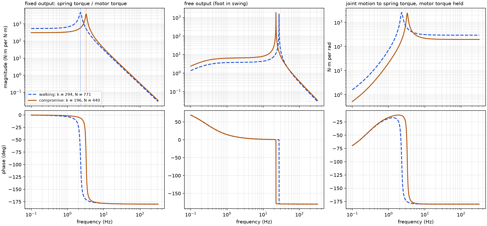

# SEA plant model

Linear model of the actuator for torque control (`anklesea.plant`, python-control). The controlled output is the spring torque `tau_s = k (theta_m / N - theta)`, measured from the spring deflection; the input is the motor torque `k_t i` (the driver's current loop is modeled in the time-domain simulation, section 15). The motor equation is the one used for sizing, `J theta_m_ddot + b theta_m_dot = tau_m - tau_s / (N eta)`, so on the joint side the rotor appears as an inertia `eta J N^2` and damping `eta b N^2`. The foot below the spring has inertia `J_L = 0.01 kg m^2` (assumption, `docs/assumptions.md`).

| design | k (N·m/rad) | N | reflected inertia `eta J N^2` (kg m²) | reflected damping (N·m·s/rad) | DC gain `N eta` | fixed-output resonance (Hz) | free-output resonance (Hz) |
|---|---|---|---|---|---|---|---|
| walking | 294 | 771 | 1.41 | 2.36 | 540 | 2.30 | 27.4 |
| compromise | 196 | 440 | 0.46 | 0.77 | 308 | 3.28 | 22.5 |

*Bode plots of the two designs. Left: joint held (stance). Middle: joint free with the foot's inertia (swing). Right: how joint motion disturbs the spring torque when the motor torque is held. Dotted lines mark the fixed-output resonances.*

## Reading the plots

- **Fixed output.** A lightly damped second-order low-pass, `N eta k / (eta J N^2 s^2 + eta b N^2 s + k)`: the spring against the reflected rotor inertia. The resonance is low, 3.3 Hz for the compromise design and 2.3 Hz for the walking-tuned one, because the high ratio makes the reflected inertia large (0.46 kg m², about 46 times the foot's). The friction gives a damping ratio of only 0.040. The tests check the DC gain (`N eta`) and the resonance (`sqrt(k / (eta J N^2))`).
- **Free output.** Zero DC gain (a free foot cannot hold a steady torque; the torque only accelerates it) and a resonance at `sqrt(k (1 / (eta J N^2) + 1 / J_L))` = 22.5 Hz, set by the light foot on the spring.
- **Joint motion.** With the motor torque held, slow joint motion is followed by the rotor and does not change the spring torque; above the fixed-output resonance the rotor cannot follow and the joint motion deflects the spring fully (`-k theta`). In level walking, 53% of the joint-velocity power lies above the walking-tuned design's resonance and 30% above the compromise design's, so the controller must reject joint motion as a disturbance. This is why the feedforward of section 13 uses the measured joint motion.

The low open-loop resonance is the price of the energy-optimal design: the same large reflected inertia that a spring decouples from the joint for efficiency makes the actuator slow to change its torque without feedback. The controller has to raise the torque bandwidth well above the open-loop resonance, which feedback can do only as far as the motor's voltage and current allow.
