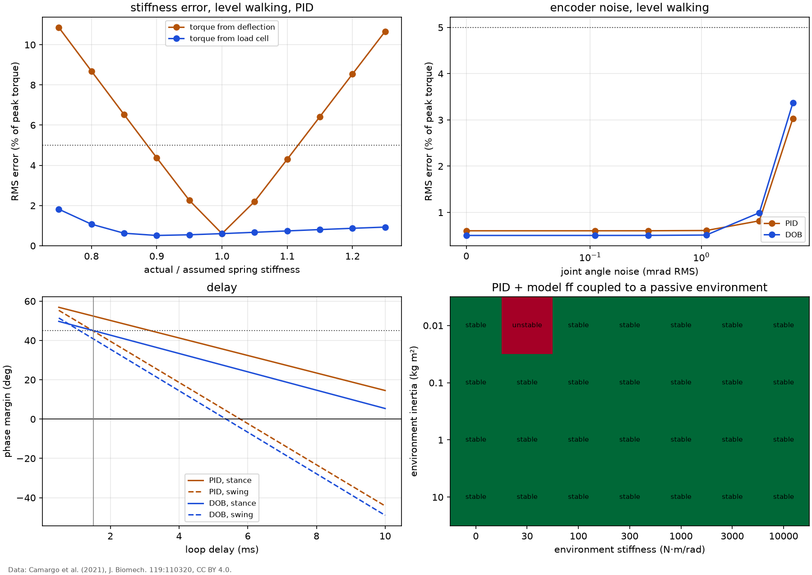

# Robustness of the torque controllers

Compromise design (k = 205 N·m/rad, N = 603), with the PID and the PD + DOB of `results/torque_pid.md` and `results/torque_dob.md`, both with model feedforward. The controllers keep their nominal model while the plant, the sensors or the timing change. Time-domain results come from the nonlinear simulation of `results/tracking.md` (drive limits included); margins from the linear model.

## Tracking under model errors, noise and delay

Worst RMS error over the five activities of the daily mix (% of peak torque, the activity in brackets) and the largest share of a stride spent at a drive limit (%). Rows marked ** miss the 5 % target with the PID.

| case | PID: worst RMS error (%) | PID: saturated (%) | DOB: worst RMS error (%) | DOB: saturated (%) |
|---|---|---|---|---|
| nominal | 0.67 (ramp descent) | 3 | 0.59 (ramp descent) | 2 |
| spring stiffness x0.8, deflection sensor ** | 11.24 (stair descent) | 3 | 11.41 (stair descent) | 2 |
| spring stiffness x0.9, deflection sensor ** | 5.64 (stair descent) | 3 | 5.75 (stair descent) | 2 |
| spring stiffness x1.1, deflection sensor ** | 5.60 (stair descent) | 3 | 5.61 (stair descent) | 2 |
| spring stiffness x1.2, deflection sensor ** | 11.15 (stair descent) | 3 | 11.24 (stair descent) | 2 |
| spring stiffness x0.8, load cell | 1.07 (treadmill) | 9 | 0.72 (treadmill) | 9 |
| spring stiffness x1.2, load cell | 0.87 (treadmill) | 3 | 0.78 (treadmill) | 2 |
| torque constant x0.9 | 0.82 (ramp descent) | 2 | 0.81 (ramp descent) | 2 |
| torque constant x1.1 | 0.70 (ramp descent) | 6 | 0.52 (ramp descent) | 6 |
| rotor inertia x1.3 | 0.86 (ramp descent) | 3 | 1.01 (ramp descent) | 3 |
| friction x3 | 0.61 (stair descent) | 2 | 0.51 (stair descent) | 2 |
| joint angle noise 0.11 mrad RMS | 0.66 (ramp descent) | 2 | 0.58 (ramp descent) | 2 |
| joint angle noise 1.11 mrad RMS | 0.61 (treadmill) | 2 | 0.54 (ramp descent) | 2 |
| joint angle noise 3.32 mrad RMS | 1.07 (stair descent) | 18 | 1.46 (stair descent) | 18 |
| torque noise 1 N·m RMS | 0.81 (ramp descent) | 9 | 0.89 (stair descent) | 10 |
| loop delay +1 ms | 0.75 (ramp descent) | 3 | 0.66 (ramp descent) | 3 |
| loop delay +2 ms | 0.83 (ramp descent) | 3 | 0.74 (ramp descent) | 3 |
| loop delay +4 ms | 1.02 (ramp descent) | 3 | 0.91 (ramp descent) | 3 |

Noise levels: 0.11 mrad RMS is the quantization noise of a 14-bit absolute joint encoder (resolution 0.38 mrad, an assumed sensor); the larger values stand for a coarser or noisier sensor. The angle noise enters twice: through the torque, measured as the difference between the motor and joint encoders, and through the joint acceleration estimated for the feedforward.

## Margins under parameter errors and delay

Phase margin in stance / swing (deg) with the 1.5 ms loop delay unless stated; the loop is marked if it is unstable.

| case | PID | PD + DOB |
|---|---|---|
| nominal | 52 / 45 | 45 / 41 |
| spring stiffness x0.8 | 50 / 48 | 42 / 43 |
| spring stiffness x1.2 | 53 / 42 | 46 / 38 |
| torque constant x0.9 (loop gain x0.9) | 52 / 45 | 44 / 41 |
| torque constant x1.1 (loop gain x1.1) | 53 / 44 | 46 / 40 |
| foot inertia 0.005 kg m² | 52 / 37 | 45 / 34 |
| foot inertia 0.03 kg m² | 52 / 51 | 45 / 46 |
| loop delay 2.5 ms | 48 / 34 | 40 / 30 |
| loop delay 3.5 ms | 44 / 24 | 36 / 20 |
| loop delay 5.5 ms | 35 / 3 | 26 / -1 **unstable** |

A torque-constant error scales the loop gain; it is modeled here as a matching change of the efficiency with the reflected inertia and friction held. The delay margin of the PID, the extra pure delay that would use up the phase margin, is 11.8 ms in stance and 4.3 ms in swing.

## Coupled stability with passive environments

The tracking simulations prescribe the joint motion. In use, the joint is moved by the user's body and the ground, and the actuator must stay stable whatever that environment is. `results/torque_dob.md` found that no controller is strictly passive with the loop delay, so passivity cannot guarantee it; instead, the actuator's joint-motion response is coupled to a grid of passive environments `J_e theta_ddot + b_e theta_dot + k_e theta = tau_s` (inertia 0.01, 0.1, 1, 10 kg m²; stiffness 0, 30, 100, 300, 1000, 3000, 10000 N·m/rad; damping ratio 0.05) and checked with the Nyquist criterion (`anklesea.torque_control.coupled_stable`). The grid spans a free foot (0.01 kg m², no stiffness) to a joint held by the whole body through a stiff socket.

| controller | stable cases | unstable cases |
|---|---|---|
| PD (passive without delay) | 28 of 28 | none |
| PID + model ff | 27 of 28 | J = 0.01, k = 30 |
| PD + DOB + model ff | 27 of 28 | J = 0.01, k = 30 |

*Top left: tracking error against the ratio of actual to assumed spring stiffness, with the torque measured from the spring deflection (as designed) or by a load cell. Top right: tracking error against joint-angle noise. Bottom left: phase margin against loop delay (grey line: the nominal 1.5 ms). Bottom right: coupled stability of the PID with model feedforward over the environment grid. Data: Camargo et al. (2021), J. Biomech. 119:110320, CC BY 4.0.*

## Reading the results

- **Spring stiffness is the parameter that matters most, and through the sensor, not the controller.** The torque is computed as nominal stiffness times deflection, so a spring 20 % softer than assumed reads 25 % high and the loop delivers 20 % too little torque: the worst error grows from 0.7 % to 11.2 %. With a load cell the same spring error costs almost nothing (1.1 %). The spring must be calibrated on the assembled actuator, and its stiffness checked for drift with temperature and wear.
- **Motor constants** (torque constant, rotor inertia, friction) change the feedforward and the loop gain; the feedback absorbs these errors and the tracking stays within the target.
- **Noise** matters through the joint acceleration estimate: the feedforward multiplies it by the reflected inertia, so encoder noise becomes torque noise and, at high levels, voltage saturation (the saturated share of the stride grows with the noise in the table). At the quantization level of a 14-bit encoder the effect is invisible; the PID's level-walking error doubles at 6.6 mrad RMS, 60 times the quantization noise. A lower derivative filter cut-off would trade noise for lag.
- **Delay** costs phase margin at about 4 deg per millisecond in stance and 10 deg per millisecond in swing, where the crossover is higher. Swing therefore sets the delay budget: at 5.5 ms the PID's swing margin is down to 3 deg and the DOB's swing loop is unstable. The tracking simulation does not show this, because it prescribes the joint motion and so never has a free foot; the extra-delay rows of the first table only describe stance-like tracking.
- **Coupled stability**: PD alone is stable with every environment in the grid. With the model feedforward and the delay, both PID and DOB destabilize a light inertia (0.01 kg m², a foot) on a soft, lightly damped spring: in a finer scan (1 to 1000 N·m/rad) the coupled system is unstable for every stiffness from the lowest tried, 1, up to 32 N·m/rad. These environments resonate at 2 to 9 Hz, the band where `results/torque_dob.md` found the delayed feedforward makes the actuator non-passive. Environment damping of 0.104 N·m·s/rad restores stability over that whole range (the most demanding case is 16 N·m/rad), the same order as the passivity violation found there. Whether a real foot meets such an environment (lightly held by something soft, in swing) is not established here; the safe reading is that the joint-motion feedforward should be faded out in swing, together with the integrator, as PD alone is stable with every environment tried.
