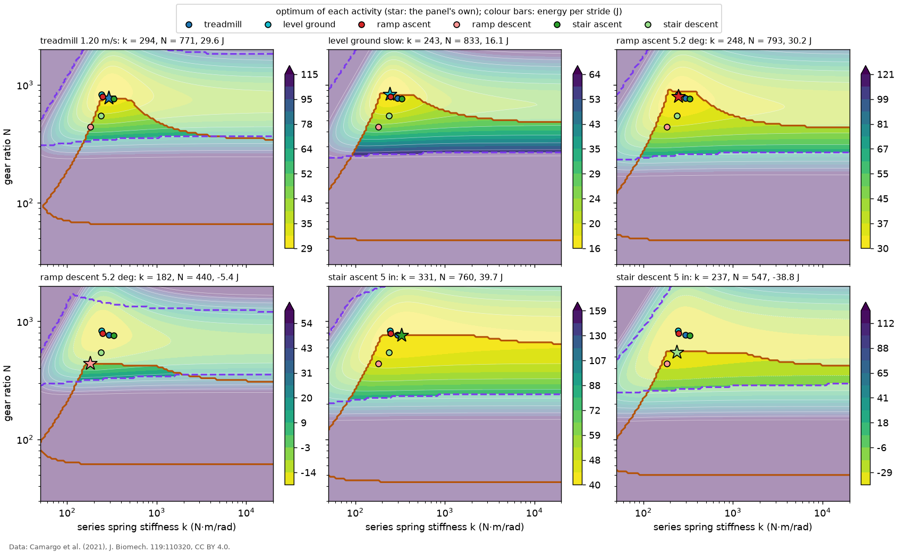
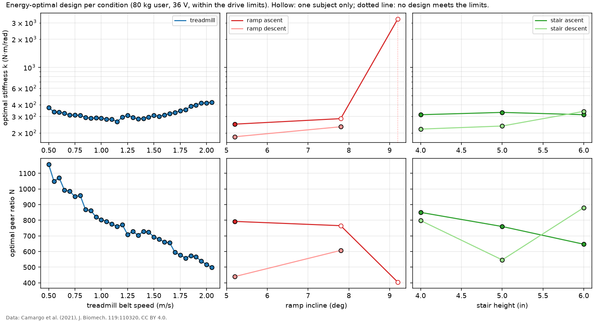

# Sizing across activities

The spring stiffness `k` and gear ratio `N` that minimize the motor's electrical energy per stride, sized separately for each activity and condition in the dataset. Same actuator, user mass (80 kg) and bus voltage (36 V) as `results/sizing_levelwalk.md`. Each optimum meets the drive limits (voltage, 30 A peak current, motor speed); it is found by scanning 600 ratios from 30 to 2000 with the closed-form optimum in compliance clipped to the feasible interval at each ratio (`anklesea.sizing.optimize`, checked against the grid search in `results/convex_check.md`).

*Energy per stride over (k, N) for one condition per activity (the one with the most subjects; treadmill at 1.2 m/s). Veiled designs break a drive limit. The star is the panel's own optimum; the dots are the other activities' optima, to show how far apart they lie. Data: Camargo et al. (2021), CC BY 4.0.*

*Energy-optimal stiffness and ratio against walking speed, ramp incline and stair height. Data: Camargo et al. (2021), CC BY 4.0.*

## Design table

Bold rows are the conditions in the contour figure. "Rigid" is the best rigid actuator within the drive limits. Joint work is per stride at the design user mass.

| activity | condition | subjects (strides) | peak torque (N·m) | joint work net / positive (J) | k (N·m/rad) | N | energy (J) | no regen. (J) | rigid (J) | peak / RMS current (A) | peak voltage (V) | binding limit |
|---|---|---|---|---|---|---|---|---|---|---|---|---|
| treadmill | 0.50 m/s | 2 (40) | 124 | -6.2 / 13.6 | 371 | 1158 | -1.9 | 18.2 | 2.5 | 6.5 / 3.63 | 28.7 | none |
| treadmill | 0.55 m/s | 2 (41) | 127 | -5.4 / 15.2 | 337 | 1049 | 0.9 | 23.9 | 7.5 | 7.4 / 4.13 | 28.5 | none |
| treadmill | 0.60 m/s | 2 (43) | 135 | -4.0 / 18.3 | 333 | 1072 | 3.6 | 27.3 | 12.4 | 7.8 / 4.36 | 30.8 | none |
| treadmill | 0.65 m/s | 2 (68) | 133 | -5.6 / 17.6 | 324 | 992 | 1.5 | 27.7 | 13.0 | 9.0 / 4.60 | 31.5 | none |
| treadmill | 0.70 m/s | 2 (46) | 138 | -2.8 / 20.7 | 311 | 985 | 6.9 | 33.5 | 22.8 | 9.2 / 4.96 | 32.6 | none |
| treadmill | 0.75 m/s | 2 (48) | 140 | -2.2 / 21.8 | 309 | 951 | 8.3 | 33.9 | 26.5 | 9.3 / 5.21 | 34.0 | none |
| treadmill | 0.80 m/s | 2 (48) | 143 | -1.7 / 23.5 | 309 | 958 | 8.8 | 35.7 | 29.0 | 9.5 / 5.22 | 34.0 | none |
| treadmill | 0.85 m/s | 2 (48) | 143 | -1.1 / 24.3 | 293 | 868 | 10.9 | 35.7 | 33.8 | 10.0 / 5.75 | 34.1 | voltage |
| treadmill | 0.90 m/s | 2 (49) | 147 | 3.7 / 27.1 | 287 | 862 | 17.9 | 41.5 | 44.9 | 10.5 / 5.86 | 34.2 | voltage |
| treadmill | 0.95 m/s | 2 (51) | 147 | 3.5 / 26.8 | 289 | 821 | 18.5 | 42.5 | 47.5 | 10.9 / 6.30 | 34.2 | voltage |
| treadmill | 1.00 m/s | 2 (53) | 148 | 4.3 / 27.5 | 288 | 804 | 20.1 | 44.4 | 52.3 | 11.2 / 6.46 | 34.1 | voltage |
| treadmill | 1.05 m/s | 2 (80) | 150 | 5.2 / 29.5 | 280 | 793 | 21.7 | 47.2 | 57.3 | 11.5 / 6.58 | 34.2 | voltage |
| treadmill | 1.10 m/s | 2 (55) | 150 | 6.9 / 30.2 | 281 | 776 | 24.3 | 47.1 | infeasible | 11.9 / 6.79 | 34.2 | voltage |
| treadmill | 1.15 m/s | 2 (56) | 152 | 9.3 / 32.2 | 264 | 760 | 27.8 | 52.6 | infeasible | 12.1 / 6.80 | 34.2 | voltage |
| **treadmill** | **1.20 m/s** | 2 (58) | 153 | 10.7 / 33.8 | 294 | 771 | 29.6 | 49.2 | infeasible | 12.5 / 6.93 | 34.2 | voltage |
| treadmill | 1.25 m/s | 2 (59) | 153 | 12.0 / 35.2 | 309 | 709 | 32.8 | 48.3 | infeasible | 13.7 / 7.50 | 34.2 | voltage |
| treadmill | 1.30 m/s | 2 (59) | 160 | 13.0 / 37.1 | 293 | 729 | 33.5 | 55.3 | infeasible | 13.6 / 7.16 | 34.2 | voltage |
| treadmill | 1.35 m/s | 2 (61) | 162 | 16.6 / 40.1 | 282 | 704 | 39.2 | 61.8 | infeasible | 14.0 / 7.39 | 34.2 | voltage |
| treadmill | 1.40 m/s | 2 (61) | 160 | 15.4 / 38.3 | 286 | 729 | 36.7 | 59.3 | infeasible | 13.3 / 7.15 | 34.2 | voltage |
| treadmill | 1.45 m/s | 2 (94) | 164 | 15.9 / 40.1 | 295 | 724 | 37.6 | 61.2 | infeasible | 13.5 / 7.26 | 34.2 | voltage |
| treadmill | 1.50 m/s | 2 (63) | 167 | 17.4 / 41.7 | 307 | 694 | 40.6 | 64.0 | infeasible | 14.3 / 7.64 | 34.1 | voltage |
| treadmill | 1.55 m/s | 2 (64) | 168 | 20.4 / 43.4 | 301 | 679 | 45.1 | 68.3 | infeasible | 14.6 / 7.67 | 34.2 | voltage |
| treadmill | 1.60 m/s | 2 (65) | 169 | 21.4 / 44.5 | 311 | 661 | 46.7 | 69.7 | infeasible | 15.1 / 7.84 | 34.2 | voltage |
| treadmill | 1.65 m/s | 2 (64) | 173 | 22.8 / 46.4 | 323 | 656 | 49.1 | 73.1 | infeasible | 15.6 / 7.93 | 34.1 | voltage |
| treadmill | 1.70 m/s | 2 (70) | 172 | 24.2 / 45.9 | 329 | 595 | 53.0 | 77.8 | infeasible | 17.5 / 8.67 | 34.2 | voltage |
| treadmill | 1.75 m/s | 2 (72) | 173 | 26.6 / 47.4 | 344 | 578 | 56.7 | 78.7 | infeasible | 18.0 / 8.92 | 34.2 | voltage |
| treadmill | 1.80 m/s | 2 (73) | 174 | 28.6 / 48.6 | 354 | 558 | 60.2 | 83.0 | infeasible | 19.1 / 9.20 | 34.2 | voltage |
| treadmill | 1.85 m/s | 2 (108) | 174 | 29.1 / 49.7 | 384 | 574 | 60.4 | 81.5 | infeasible | 18.6 / 9.02 | 34.2 | voltage |
| treadmill | 1.90 m/s | 2 (74) | 173 | 29.1 / 48.9 | 398 | 566 | 60.2 | 81.3 | infeasible | 18.8 / 9.10 | 34.2 | voltage |
| treadmill | 1.95 m/s | 2 (73) | 170 | 31.5 / 51.0 | 417 | 539 | 65.1 | 86.5 | infeasible | 19.7 / 9.41 | 34.2 | voltage |
| treadmill | 2.00 m/s | 2 (74) | 169 | 33.2 / 52.7 | 418 | 517 | 68.3 | 89.6 | infeasible | 20.5 / 9.75 | 34.2 | voltage |
| treadmill | 2.05 m/s | 2 (75) | 171 | 35.3 / 53.7 | 425 | 499 | 72.1 | 93.0 | infeasible | 21.6 / 10.01 | 34.2 | voltage |
| **level ground** | **slow** | 2 (3) | 113 | 5.2 / 20.9 | 243 | 833 | 16.1 | 32.0 | 27.9 | 8.3 / 4.46 | 34.0 | none |
| level ground | normal | 1 (8) | 144 | 8.6 / 31.8 | 266 | 804 | 24.1 | 47.7 | 46.0 | 10.7 / 5.48 | 34.2 | voltage |
| level ground | fast | 1 (4) | 164 | 19.6 / 46.0 | 216 | 499 | 50.4 | 90.6 | infeasible | 20.3 / 9.11 | 34.2 | voltage |
| **ramp ascent** | **5.2 deg** | 2 (6) | 112 | 14.8 / 25.4 | 248 | 793 | 30.2 | 41.3 | 42.3 | 9.1 / 4.83 | 30.5 | none |
| ramp ascent | 7.8 deg | 1 (2) | 129 | 21.2 / 32.5 | 284 | 765 | 41.4 | 53.5 | 55.8 | 12.1 / 5.58 | 25.6 | none |
| ramp ascent | 9.2 deg | 1 (2) | 107 | 20.7 / 24.4 | 3298 | 404 | 53.2 | 63.5 | 54.9 | 19.8 / 9.12 | 34.2 | voltage |
| **ramp descent** | **5.2 deg** | 2 (11) | 144 | -24.5 / 30.7 | 182 | 440 | -5.4 | 35.5 | infeasible | 21.2 / 10.50 | 34.2 | voltage |
| ramp descent | 7.8 deg | 2 (10) | 141 | -22.7 / 31.3 | 233 | 607 | -15.5 | 24.1 | infeasible | 14.5 / 7.64 | 34.2 | voltage |
| ramp descent | 9.2 deg | 1 (5) | 169 | -26.4 / 40.0 | none |  |  |  |  |  |  |  |
| stair ascent | 4 in | 2 (11) | 90 | 13.6 / 16.7 | 313 | 850 | 26.0 | 32.3 | 29.3 | 7.5 / 3.70 | 32.1 | none |
| **stair ascent** | **5 in** | 2 (14) | 101 | 21.3 / 24.1 | 331 | 760 | 39.7 | 47.0 | 43.5 | 12.1 / 4.89 | 34.1 | voltage |
| stair ascent | 6 in | 2 (6) | 98 | 22.2 / 24.5 | 313 | 647 | 40.3 | 44.4 | 43.5 | 9.5 / 4.56 | 34.1 | voltage |
| stair descent | 4 in | 2 (11) | 110 | -32.0 / 16.1 | 220 | 798 | -35.3 | 6.6 | -23.9 | 8.8 / 4.78 | 34.2 | voltage |
| **stair descent** | **5 in** | 2 (12) | 117 | -38.3 / 17.5 | 237 | 547 | -38.8 | 9.1 | -25.1 | 14.4 / 7.30 | 34.0 | none |
| stair descent | 6 in | 2 (9) | 123 | -38.8 / 19.6 | 340 | 881 | -42.7 | 10.3 | -11.9 | 10.1 / 5.33 | 32.0 | none |

## Observations

- **The stiffness changes little; the ratio changes a lot.** Over the conditions with at least two subjects, 80 % of the optimal stiffnesses lie between 244 and 383 N·m/rad (representative conditions: 182 to 331), while the ratio spans 440 to 833 over the representative conditions and falls from 1158 at 0.50 m/s to 499 at 2.05 m/s on the treadmill. The voltage limit binds in 33 of 46 conditions: faster joint motion means more back EMF per unit ratio, so the ratio has to drop, and the spring stays near the value that cancels motor motion at push-off.
- **Descent returns energy.** On ramp and stair descent the ankle does net negative work, so with ideal regeneration the motor's energy per stride is negative (-42.7 to -5.4 J): the actuator would charge the battery. Without regeneration the same designs cost 6.6 to 35.5 J. The optimum with regeneration maximizes what is recovered, which is only meaningful if the driver and battery can take it back; section 10 uses both measures.
- No design meets the drive limits for ramp descent 9.2 deg (1 subject, 5 strides).
- 13 of 47 conditions have a design that also meets the motor's continuous current rating: treadmill 0.50 m/s, treadmill 0.55 m/s, treadmill 0.60 m/s, treadmill 0.65 m/s, treadmill 0.70 m/s, treadmill 0.75 m/s, level ground slow, ramp ascent 5.2 deg, stair ascent 4 in, stair ascent 5 in, stair ascent 6 in, stair descent 4 in, stair descent 6 in. Level walking at 1.2 m/s and faster is not among them.
- A rigid actuator meets the drive limits in 23 of 46 conditions that have a feasible SEA design, mostly slow walking and stairs, where the joint moves slowly at peak torque.
- Profiles that rest on one subject or a handful of strides (see the subjects column) are less reliable; a single-subject outlier such as ramp ascent at 9.2 deg should not be read as a trend. The treadmill profiles rest on every stride of every subject.

Section 10 (`results/cross_mode.md`) asks what a design tuned for level walking costs in the other activities, and what a compromise design looks like.
