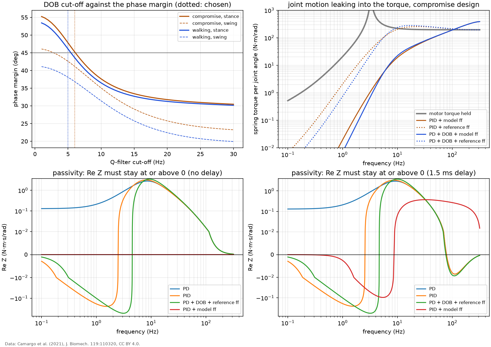

# Torque control: disturbance observer, and passivity

A disturbance observer (DOB) after N. Paine, S. Oh and L. Sentis, "Design and control considerations for high-performance series elastic actuators", IEEE/ASME Trans. Mechatronics 19(3):1080-1091, 2014, implemented from that description in `anklesea.torque_control` and compared with the PID of `results/torque_pid.md`. The DOB uses the nominal fixed-output model `Pn`: whatever makes the measured spring torque differ from what `Pn` predicts for the command it sent is treated as a disturbance at the motor and cancelled below the cut-off of a second-order low-pass `Q`. Because `Q(0) = 1` it acts as integral action, so it is paired with the same PD gains as the PID, without the integral. Every result includes the 1.5 ms loop delay unless stated.

## Q-filter cut-off

The cut-off trades disturbance rejection against margin: the DOB inverts the nominal model up to the cut-off, and the loop delay is not in that model. The cut-off is the highest (on a 0.5 Hz grid) for which the stance loop still meets the targets of `results/torque_pid.md` (phase margin 45 deg, gain margin 10 dB, `max |S|` 2): **5.5 Hz** for the compromise design and **5.0 Hz** for the walking-tuned one. That is below the bandwidth of the PID loop, so the DOB here works in the same frequency range as the integral action it replaces, not above it.

## Margins

Each cell: stability (closed-loop poles with a Pade approximation of the delay), phase margin, gain margin (and lower gain margin if the loop is conditionally stable), `max |S|`.

| design | controller | stance (fixed output) | swing (free output) |
|---|---|---|---|
| walking | PID + model ff | stable, 52 deg, 19 dB, 1.29 | stable, 43 deg, 18 dB, 1.53 |
| walking | PID + reference ff | stable, 52 deg, 19 dB, 1.29 | stable, 43 deg, 18 dB, 1.53 |
| walking | PD + DOB + model ff | stable, 46 deg, 19 dB, lower 15, 1.36 | stable, 40 deg, 18 dB, 1.61 |
| walking | PD + DOB + reference ff | stable, 46 deg, 19 dB, lower 15, 1.36 | stable, 40 deg, 18 dB, 1.61 |
| compromise | PID + model ff | stable, 52 deg, 19 dB, 1.29 | stable, 45 deg, 19 dB, 1.49 |
| compromise | PID + reference ff | stable, 52 deg, 19 dB, 1.29 | stable, 45 deg, 19 dB, 1.49 |
| compromise | PD + DOB + model ff | stable, 45 deg, 19 dB, lower 15, 1.38 | stable, 41 deg, 18 dB, 1.59 |
| compromise | PD + DOB + reference ff | stable, 45 deg, 19 dB, lower 15, 1.38 | stable, 41 deg, 18 dB, 1.59 |

"Reference ff" is the inverse model applied to the reference only; it needs no joint acceleration. "Model ff" adds the measured joint motion. With the DOB and model feedforward, the joint motion is put into the DOB's nominal model as well, so that it is not compensated twice.

## Tracking with model error

Worst RMS error over the five activities of the daily mix (% of peak torque), linear model with delay. The feedforward and the DOB keep using the nominal model while the plant changes.

| design | controller | nominal | spring 20 % softer | friction x3 | gear efficiency -10 % |
|---|---|---|---|---|---|
| walking | PID + model ff | 0.13 | 0.65 | 0.32 | 0.23 |
| walking | PID + reference ff | 3.23 | 3.04 | 3.12 | 3.28 |
| walking | PD + DOB + model ff | 0.13 | 0.53 | 0.17 | 0.17 |
| walking | PD + DOB + reference ff | 2.89 | 2.83 | 2.79 | 2.91 |
| compromise | PID + model ff | 0.11 | 0.65 | 0.29 | 0.29 |
| compromise | PID + reference ff | 2.81 | 2.60 | 2.70 | 2.89 |
| compromise | PD + DOB + model ff | 0.11 | 0.50 | 0.15 | 0.18 |
| compromise | PD + DOB + reference ff | 2.42 | 2.35 | 2.33 | 2.45 |

*Top left: phase margin against the DOB cut-off. Top right: how much joint motion reaches the spring torque with zero torque reference, compromise design (the PID and DOB curves with model feedforward are close to each other). Bottom: real part of the interaction impedance with zero torque reference, without and with the loop delay (symmetric log scale). Data: Camargo et al. (2021), J. Biomech. 119:110320, CC BY 4.0.*

## Joint-motion rejection

Spring torque per unit joint motion relative to the spring stiffness (dB; 0 dB means the joint motion deflects the spring fully), compromise design, at the stride frequency and two harmonics.

| controller | 1 Hz | 2 Hz | 4 Hz |
|---|---|---|---|
| motor torque held (no control) | -14 | 6 | 4 |
| PID + model ff | -80 | -59 | -39 |
| PID + reference ff | -40 | -24 | -11 |
| PD + DOB + model ff | -88 | -64 | -41 |
| PD + DOB + reference ff | -48 | -30 | -12 |

## Reading the comparison

- **With the joint acceleration available**, the DOB adds nothing measurable: PID and PD + DOB with model feedforward track to 0.11 % and 0.11 % and degrade alike under every model error (for example 0.65 % and 0.50 % with a 20 % softer spring). Both have integral action at low frequency, and the feedforward already removes almost everything the DOB would estimate.
- **Without the joint acceleration** (reference feedforward only), the joint motion is a real disturbance. The DOB at 5.5 Hz rejects it in the same band as the PID's integral term, and the two end up close: 2.81 % for the PID and 2.42 % for the DOB, nominal. A DOB pays off over an integral term when its cut-off can sit well above the band the integral term covers. Here the 1.5 ms delay and the low open-loop resonance of a high-ratio design leave no room for that: above a few hertz the DOB eats the phase margin (top-left panel).
- In swing, the DOB's nominal model (joint held) is wrong by construction, and its margins there are lower than in stance. A practical controller would switch the DOB off in swing, as it would freeze the PID's integrator.

## Passivity

Checked numerically. The criterion is the one H. Vallery, R. Ekkelenkamp, H. van der Kooij and M. Buss, "Passive and accurate torque control of series elastic actuators", IEEE/RSJ IROS 2007, pp. 3534-3538, apply to SEA torque control: an actuator that is passive at its interaction port stays stable when coupled to any passive environment (J. E. Colgate and N. Hogan, "Robust control of dynamically interacting systems", Int. J. Control 48(1):65-88, 1988), which matters because the environment here is a person. With zero torque reference the joint sees the impedance `Z(s) = -tau_s / (s theta)`; the actuator is passive when the closed loop is stable and `Re Z(jw) >= 0` at every frequency. Compromise design, 0.0016 Hz to 1592 Hz.

| controller | without delay | with 1.5 ms delay |
|---|---|---|
| PD | passive | no: Re Z down to -0.009 at 111.1 Hz; negative over 78 to 355 Hz, 679 to 1008 Hz, 1340 to 1592 Hz |
| PID | no: Re Z down to -0.288 at 1.6 Hz; negative over 0.0016 to 2.6 Hz | no: Re Z down to -0.298 at 1.6 Hz; negative over 0.0016 to 2.7 Hz, 78 to 355 Hz, 679 to 1007 Hz, 1340 to 1592 Hz |
| PD + DOB + reference ff | no: Re Z down to -0.558 at 3.0 Hz; negative over 0.0016 to 4.3 Hz | no: Re Z down to -0.589 at 3.0 Hz; negative over 0.0016 to 4.4 Hz, 76 to 355 Hz, 678 to 1007 Hz, 1340 to 1592 Hz |
| PD + model ff | lossless (Z = 0) | no: Re Z down to -0.068 at 5.6 Hz; negative over 0.0016 to 8.7 Hz, 333 to 667 Hz, 1000 to 1333 Hz |
| PID + model ff | lossless (Z = 0) | no: Re Z down to -0.104 at 5.4 Hz; negative over 0.0016 to 8.7 Hz, 333 to 667 Hz, 1000 to 1333 Hz |
| PD + DOB + model ff | lossless (Z = 0) | no: Re Z down to -0.165 at 6.4 Hz; negative over 0.0018 to 10 Hz, 333 to 667 Hz, 1000 to 1333 Hz |

- **Without delay**, PD torque control is passive. Integral action breaks passivity at low frequency, whether it comes from the PID's integral term (Re Z down to -0.29 N·m·s/rad, below 2.6 Hz) or from the DOB (-0.56 N·m·s/rad, below 4.3 Hz): the integrator keeps pushing the rotor while the user moves the joint, and over a slow cycle it can return more energy than the user put in. With exact model feedforward the actuator cancels the joint motion completely and `Z` is zero (lossless) in the nominal model.
- **With the 1.5 ms delay** no configuration is strictly passive. For PD the violation is small and lies only above 78 Hz (Re Z down to -0.0091 N·m·s/rad). With the model feedforward the delay turns the perfect cancellation into a small mismatch (Re Z down to -0.104 N·m·s/rad at 5.4 Hz).
- The size of a violation is the damping that, added in parallel at the joint, would make the actuator passive. Vallery et al. compare several torque-control structures and conclude that a cascade with a fast inner motor-velocity loop is the best option, with parameter bounds under which the torque loop may keep integral action and stay passive. The controllers here command motor torque directly, with no velocity loop, and in that structure accuracy (integral action) and passivity pull in opposite directions. This study keeps the integral action and lists passivity as a limitation; the cascaded structure is the documented way out and is not implemented here.
