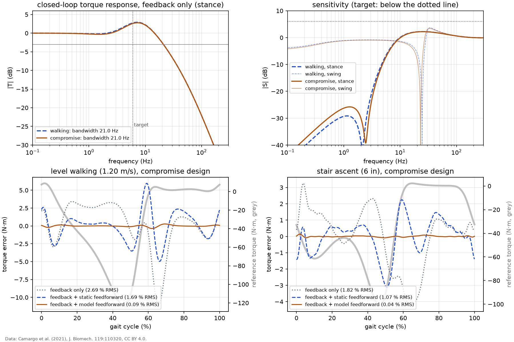

# Torque control: PID with model-based feedforward

Controller for the spring torque of the two reference designs (`anklesea.torque_control`), designed on the linear plant of `results/plant.md`. The controller runs at 1000 Hz; its delay (one sample of computation plus half a sample of zero-order hold, 1.5 ms) is included in every margin and tracking result. The motor's current loop is assumed ideal here and is modeled, with saturation, in `results/tracking.md`.

## Targets (set before tuning)

The torque reference comes from the gait data, so the bandwidth target does too: the frequency below which almost all of the torque signal's power lies (stride-averaged torque of each activity in the daily mix, `results/cross_mode.md`).

| activity | 99 % of torque power below (Hz) | 99.9 % below (Hz) |
|---|---|---|
| level walking (1.20 m/s) | 3.9 | 5.8 |
| ramp ascent (5.2 deg) | 4.1 | 4.9 |
| ramp descent (5.2 deg) | 3.4 | 5.1 |
| stair ascent (6 in) | 4.1 | 4.9 |
| stair descent (6 in) | 2.7 | 4.5 |

1. **Bandwidth** (feedback alone, stance, -3 dB of the closed loop): at least 6 Hz. This covers 99.9 % of the torque power in every activity except stair descent, whose landing transient is sharper.
2. **Margins** with the 1.5 ms loop delay, in stance and in swing: phase margin at least 45 deg, gain margin at least 10 dB (in both directions if the loop is conditionally stable), peak sensitivity `max |S|` at most 2 (6 dB).
3. **Zero steady-state error** (integral action).
4. **Tracking**: RMS error at most 5 % of the peak torque in every activity, judged in the nonlinear simulation with voltage and current limits (`results/tracking.md`). The linear results below are the best case.

## Tuning

PD by pole placement on the fixed-output plant (derivation in the module docstring of `anklesea.torque_control`): the closed-loop poles are put at 8 Hz with damping 0.7, the integral corner at 0.2 of that frequency and the derivative filter at ten times it. The proportional gain raises the spring-rotor resonance from 2.5 Hz (compromise design) to 8 Hz; the derivative gain damps it. The gains are tiny in N·m per N·m because the gear multiplies motor torque by `N eta`, 422 for the compromise design.

| design | Kp (N·m/N·m) | Ki (1/s) | Kd (ms) | derivative filter (ms) | Kp in A per N·m of error |
|---|---|---|---|---|---|
| walking | 0.0251 | 0.252 | 0.734 | 1.99 | 1.22 |
| compromise | 0.0228 | 0.230 | 0.686 | 1.99 | 1.11 |

The first tuning put the poles at 6 Hz with the integral corner at 0.1 of that. It met the bandwidth target and the stance margins, but the loop gain at the stride harmonics was low: for the compromise design the closed loop already sagged below 0 dB under 6 Hz, the sensitivity at the stride frequency (0.96 Hz) was weaker, and feedback alone left 6 % RMS error (table below). Bandwidth measured at -3 dB says nothing about how flat the response is below it, and a gait torque has most of its power at the first few stride harmonics, so what matters is the loop gain there. A higher placement and integral corner raise it; the integral corner cannot go much higher, because an integrator ahead of a lightly damped resonance makes the loop conditionally stable (it would turn unstable if its gain dropped), which `loop_metrics` reports as a lower gain margin.

| design | tuning | pole placement (Hz) | integral corner / placement | bandwidth (Hz) | lowest \|T\| up to 6 Hz (dB) | \|S\| at the stride frequency (dB) | phase margin (deg) | worst RMS error, feedback only (%) |
|---|---|---|---|---|---|---|---|---|
| walking | first | 6 | 0.1 | 15.1 | -0.8 | -20.1 | 56 | 5.4 |
| walking | final | 8 | 0.2 | 21.0 | -0.2 | -29.4 | 52 | 2.8 |
| compromise | first | 6 | 0.1 | 15.0 | -1.2 | -17.2 | 57 | 6.3 |
| compromise | final | 8 | 0.2 | 21.0 | -0.3 | -26.4 | 52 | 2.8 |

## Margins and bandwidth

| design | phase of gait | bandwidth (Hz) | gain crossover (Hz) | phase margin (deg) | gain margin (dB) | lower gain margin (dB) | max \|S\| | meets targets 1 and 2 |
|---|---|---|---|---|---|---|---|---|
| walking | stance (fixed output) | 21.0 | 12.3 | 52 | 19.4 | none | 1.29 | yes |
| walking | swing (free output) | n/a | 30.6 | 43 | 18.5 | none | 1.53 | **no** |
| compromise | stance (fixed output) | 21.0 | 12.4 | 52 | 19.4 | none | 1.29 | yes |
| compromise | swing (free output) | n/a | 29.1 | 45 | 18.6 | none | 1.49 | **no** |

*Top: closed-loop torque response and sensitivity with the 1.5 ms delay. Bottom: steady-state tracking error over one stride for the compromise design, linear model; the grey line is the reference torque (scale on the right). Data: Camargo et al. (2021), J. Biomech. 119:110320, CC BY 4.0.*

The closed-loop bandwidth, 21.0 Hz for the compromise design, is higher than the 8 Hz pole placement because the derivative term adds a zero. In stance the margins are comfortable. In swing the same gains act on the free-output plant, whose sharp resonance at the foot (23 Hz) moves the gain crossover up to 29 Hz, where the delay costs more phase: the phase margin falls to 44.8 deg for the compromise design and 43.4 deg for the walking-tuned one, both short of the 45 deg of target 2. The closed loop stays stable, but swing is where a delay or gain error would first cause trouble. Lower gains in swing, where the torque reference is near zero anyway, would move the crossover down and should restore the margin; this gain schedule is not analyzed here. The closed loop also has a pole at zero in swing: the integrator cancels the free plant's zero at DC, since a free foot cannot hold a steady torque. In practice the integrator is reset or frozen in swing.

## Linear tracking

Steady-state periodic tracking of the mean stride of each activity, computed harmonic by harmonic (exact for the linear model; checked against a 30-stride time simulation in `tests/test_torque_control.py`). Each cell is RMS error in % of the peak torque / peak error in %. The feedforward options are feedback alone, the static term `tau_ref / (N eta)` only, and the full inverse model using the measured joint motion.

| activity | compromise: feedback only | compromise: + static ff | compromise: + model ff | walking-tuned: feedback only | walking-tuned: + static ff | walking-tuned: + model ff |
|---|---|---|---|---|---|---|
| level walking (1.20 m/s) | 2.69 / 9.1 | 1.69 / 4.9 | 0.09 / 0.3 | 2.52 / 8.9 | 1.86 / 5.0 | 0.10 / 0.3 |
| ramp ascent (5.2 deg) | 2.18 / 7.4 | 1.30 / 4.0 | 0.06 / 0.2 | 1.95 / 7.0 | 1.37 / 3.8 | 0.07 / 0.2 |
| ramp descent (5.2 deg) | 2.84 / 9.7 | 1.81 / 5.0 | 0.11 / 0.4 | 2.82 / 9.8 | 2.14 / 6.2 | 0.13 / 0.5 |
| stair ascent (6 in) | 1.82 / 4.2 | 1.07 / 3.1 | 0.04 / 0.1 | 1.48 / 3.3 | 1.02 / 2.9 | 0.04 / 0.1 |
| stair descent (6 in) | 2.55 / 5.8 | 1.19 / 3.0 | 0.07 / 0.2 | 2.24 / 4.9 | 1.26 / 2.6 | 0.07 / 0.2 |

With feedback alone the compromise design tracks level walking with 2.7 % RMS error; with the joint held still it would be 2.1 %, so most of the error comes from the reference itself (finite loop gain at the stride harmonics), not from the joint motion. Reflecting the reference through the gear (static feedforward) brings the worst case to 1.8 %. The full model feedforward cancels the plant dynamics and the joint motion and leaves only the effect of the loop delay, 0.11 % RMS at worst. Without delay it would be exact, which `tests/test_torque_control.py` checks. These numbers assume a perfect model, unlimited voltage and current, and noise-free joint acceleration; `results/tracking.md` and `results/robustness.md` remove those assumptions one at a time.
