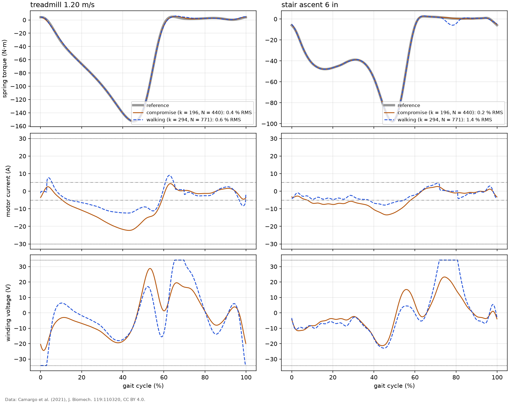

# Torque tracking with drive limits (nonlinear simulation)

Time-domain simulation of the actuator tracking the mean torque of each activity (`anklesea.simulation`). The joint angle is prescribed from the gait profile; the actuator only sets the spring torque. The simulation includes:

- the winding (`L di/dt = v - R i - k_t omega`) and the rotor, at 20 kHz;
- the driver's PI current loop (1000 Hz bandwidth, an assumption in `docs/assumptions.md`) with back-EMF compensation and anti-windup, its output clipped to 34.2 V (0.95 of the 36 V bus) and its current reference to 30 A;
- the torque controller at 1000 Hz with one sample of computation delay, discretized with the Tustin transform, its integrator frozen while the current is clipped;
- torque measured as spring deflection times the nominal stiffness;
- feedforward from the joint velocity and acceleration estimated by a 25 Hz second-order filter on the sampled joint angle (no noise here; noise is in `results/robustness.md`).

4 strides are simulated and the last is evaluated. The controllers are the PID (`results/torque_pid.md`) and the PD + DOB (`results/torque_dob.md`), both with model feedforward.

## Check against the sizing model and the linear analysis

Level walking at 1.2 m/s, limits removed, exact joint derivatives. Each cell is simulation / reference: energy per stride and currents against the inverse model used for sizing (`anklesea.sea`), tracking error against the linear harmonic solution of `results/torque_pid.md`.

| design | energy per stride (J) | RMS current (A) | peak current (A) | RMS error (%) |
|---|---|---|---|---|
| walking | 29.70 / 29.57 | 6.94 / 6.93 | 12.5 / 12.5 | 0.039 / 0.093 |
| compromise | 45.85 / 45.75 | 11.12 / 11.12 | 22.3 / 22.3 | 0.033 / 0.078 |

The energies and currents agree to within a percent, so the sizing results hold for a controlled actuator that tracks well. The tracking errors are both a fraction of a percent; they differ because the simulation's delay is a sample-and-hold, not a pure delay.

## Compromise design, PID with model feedforward

RMS and peak error in % of the peak reference torque; saturation as % of the stride; currents and voltage from the last stride; energy with ideal regeneration.

| condition | RMS error (%) | peak error (%) | voltage saturated (%) | current saturated (%) | peak current (A) | RMS current (A) | peak voltage (V) | energy (J/stride) | RMS error within 5 % |
|---|---|---|---|---|---|---|---|---|---|
| treadmill 1.20 m/s | 0.41 | 1.1 | 0.0 | 0.0 | 22.3 | 11.1 | 28.8 | 46.7 | yes |
| treadmill 2.05 m/s | 5.67 | 19.6 | 24.0 | 10.8 | 22.5 | 9.9 | 34.2 | 69.8 | **no** |
| ramp ascent 5.2 deg | 0.40 | 1.4 | 0.0 | 0.0 | 16.3 | 7.5 | 16.9 | 37.9 | yes |
| ramp ascent 9.2 deg | 1.59 | 9.6 | 3.8 | 0.0 | 24.7 | 8.4 | 34.2 | 49.3 | yes |
| ramp descent 5.2 deg | 0.47 | 1.6 | 3.1 | 0.0 | 21.6 | 10.7 | 34.2 | -4.4 | yes |
| ramp descent 9.2 deg | 2.56 | 11.4 | 9.5 | 1.6 | 25.0 | 12.8 | 34.2 | 6.6 | yes |
| stair ascent 6 in | 0.20 | 0.7 | 0.0 | 0.0 | 13.5 | 6.4 | 23.2 | 45.7 | yes |
| stair descent 6 in | 0.56 | 2.9 | 0.0 | 0.0 | 19.9 | 10.1 | 29.7 | -27.2 | yes |

## Both designs and both controllers

RMS error in % of peak torque, with the share of the stride spent at the voltage or current limit in brackets.

| condition | compromise, PID | compromise, DOB | walking-tuned, PID | walking-tuned, DOB |
|---|---|---|---|---|
| treadmill 1.20 m/s | 0.41 (0 %) | 0.35 (0 %) | 0.59 (8 %) | 0.47 (7 %) |
| treadmill 2.05 m/s | 5.67 (24 %) | 5.58 (27 %) | 8.96 (44 %) | 8.57 (43 %) |
| ramp ascent 5.2 deg | 0.40 (0 %) | 0.35 (0 %) | 0.60 (0 %) | 0.52 (0 %) |
| ramp ascent 9.2 deg | 1.59 (4 %) | 1.57 (4 %) | 5.56 (21 %) | 5.54 (20 %) |
| ramp descent 5.2 deg | 0.47 (3 %) | 0.43 (3 %) | 2.40 (8 %) | 2.37 (8 %) |
| ramp descent 9.2 deg | 2.56 (10 %) | 2.55 (10 %) | 5.24 (12 %) | 5.23 (12 %) |
| stair ascent 6 in | 0.20 (0 %) | 0.19 (0 %) | 1.39 (9 %) | 1.42 (9 %) |
| stair descent 6 in | 0.56 (0 %) | 0.53 (0 %) | 0.88 (2 %) | 0.82 (2 %) |

*Simulated torque, motor current and winding voltage over the last stride, PID with model feedforward. Dotted lines: driver limits (30 A, 34.2 V); dash-dot: the motor's continuous current rating (5.06 A), which applies to the RMS current. Data: Camargo et al. (2021), J. Biomech. 119:110320, CC BY 4.0.*

## Reading the results

- The compromise design tracks level walking with 0.41 % RMS error, most of it from estimating the joint acceleration with a filter (with exact derivatives it is a few hundredths of a percent, table above). It reaches a drive limit in treadmill 2.05 m/s, ramp ascent 9.2 deg, ramp descent 5.2 deg, ramp descent 9.2 deg. Its worst case is treadmill 2.05 m/s at 5.67 % RMS. The tracking target is missed in treadmill 2.05 m/s.
- The walking-tuned design saturates in treadmill 1.20 m/s, treadmill 2.05 m/s, ramp ascent 9.2 deg, ramp descent 5.2 deg, ramp descent 9.2 deg, stair ascent 6 in, stair descent 6 in. This is the time-domain view of what the sizing found (`results/cross_mode.md`): its high ratio needs more voltage than the driver has when the motor must spin fast. While the voltage is saturated the current cannot follow its reference, and the torque error grows until the motor slows down again.
- The DOB and the PID perform alike here, as the linear comparison predicted: with model feedforward there is little left for either to correct.
- Both designs are sized onto the voltage limit: the energy optimum of the walking-tuned design uses the full 34.2 V in level walking, and the compromise uses it in ramp descent (`results/cross_mode.md`). The inverse model needs exactly that voltage for perfect tracking, so any feedback correction or estimation error pushes the drive into saturation. A design for a real device should keep a voltage margin for control, for example by sizing against 85 to 90 % of the available voltage.
- The RMS current in level walking (11.1 A) is above the motor's continuous rating (5.06 A) for both designs. Tracking does not change this; it is the thermal limit found in the sizing (`results/sizing_modes.md`) and addressed by the parallel spring (`results/parallel_spring.md`).

## What did not work first

The first version of the simulation froze the PID integrator only when the current was clipped and fed the DOB the torque command it had computed. In treadmill 2.05 m/s, where the compromise design's drive is saturated for 24 % of the stride, that gave:

| controller | RMS error, first version (%) | RMS error, final anti-windup (%) |
|---|---|---|
| PID | 5.79 | 5.67 |
| DOB | 15.64 | 5.58 |

While the voltage is saturated, the current lags its reference; the DOB, comparing the measured torque with the *command*, sees the shortfall as a disturbance and adds it to the next command, which only deepens the saturation. Feeding the DOB the torque the motor actually produced (`k_t` times the measured current, which drives measure anyway) fixed the DOB. Freezing the PID integrator during voltage saturation as well helps the PID only a little, because its integrator is slow compared with a saturation episode.
